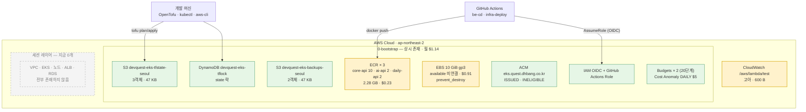
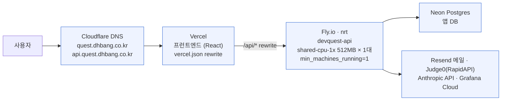
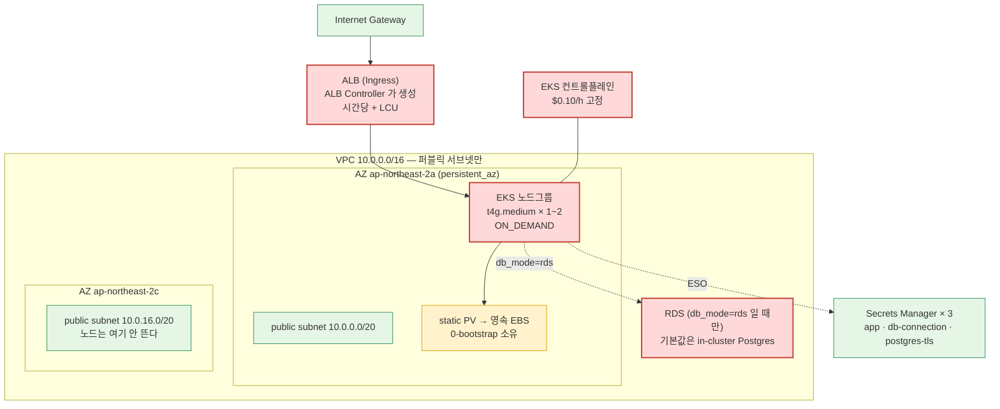

# 현재 AWS 아키텍처 (계정 전경) — 2026-09-28 실측

> 이 문서는 **계정 전체**를 본다. 레이어별 상세는 `eks-2-cluster.md`(Stage 2·3a).
> 모든 수치는 `aws` CLI 실측이며 재현 명령은 `infra/aws-eks/PERSISTENT-RESOURCES.md` §확인 명령.
>
> ### 🔄 갱신 시 두 벌을 함께 고친다 (`eks-2-cluster.md` 와 같은 규약)
> | | 파일 | 용도 |
> |---|---|---|
> | ① | **이 문서** (`aws-current.md`) | repo·PR·블로그용. GitHub 이 mermaid 를 자동 렌더 |
> | ② | `aws-current.artifact.html` | 라이브 아티팩트 소스 (줌·전체화면·과금 색구분) |
>
> **② 재발행 시 반드시 `url` 을 함께 넘긴다**:
> `https://claude.ai/code/artifact/463539d6-7c56-4126-ae3d-429d1135b140`
> ⚠️ `url` 없이 발행하면 **새 URL 이 생겨** 이 문서의 링크가 죽은 페이지를 가리킨다.
>
> 🔴 **가장 중요한 사실 두 가지**
> 1. **지금 AWS 에서 시간당 과금되는 것이 하나도 없다.** EKS·EC2·NAT·ALB·RDS 전부 **0개**.
> 2. **prod 는 AWS 에 없다.** 실사용자는 Vercel → Fly → Neon 을 탄다. AWS 는 **학습장**이다.

| 색 | 뜻 |
|---|---|
| 🔴 빨강 | **시간당 과금** — 켜져 있는 동안 돈이 나간다 |
| 🟡 노랑 | **용량 과금** — 존재하는 동안 조금씩 (월 $1.14 전부 여기) |
| 🟢 초록 | $0 |
| ⬜ 점선 | **지금 존재하지 않음** — `tofu apply` 때만 생긴다 |

---

## 0. 지금 과금되는 것 전부 — 월 **$1.14**

| 리소스 | 실측 | 월 |
|---|---|---:|
| EBS 10 GiB gp3 (`available`, 미연결) | Postgres 데이터 볼륨 · Stage 3b static PV 용 | **$0.91** |
| ECR × 3 | core-api 10개/1.75GB · ai-api 2개/0.26GB · daily-api 2개/0.27GB | **$0.23** |
| S3 × 2 | tfstate 3객체 · 백업 2객체 (합 94 KB) | ~$0 |
| DynamoDB | state 락, 항목 1개, 온디맨드 | ~$0 |
| ACM · IAM/OIDC · Budgets×2 · Cost Anomaly | 전부 무료 티어 | $0 |
| CloudWatch `/aws/lambda/test` | 🟡 **고아** 600바이트 (함수 없음) | ~$0 |

> 🔑 **아낄 것이 없다.** 비싼 것은 이미 다 꺼져 있고, 남은 것은 *"꺼두면 다음에 켤 때 더 비싼"*
> 것들뿐이다(ECR 을 비우면 세션당 재빌드 5~10분, EBS 를 스냅샷으로 내리면 3중 삭제 방어를 뚫어야 한다).

---

## 1. 지금 이 순간 — 영속 레이어만 남아 있다

---

## 2. prod 는 AWS 에 없다 — 실사용자 경로

**AWS 계정이 통째로 사라져도 서비스는 안 죽는다.** 이것이 `eks-cost-model.md` 의 안전 예비 $30 규칙이
서 있는 전제이고, 이관 계획(D-014)이 건드리려는 바로 그 전제다.

| | 현재 | 비고 |
|---|---|---|
| 프런트 | Vercel | 레포 기록상 $0 🟡 미검증 |
| 백엔드 | Fly `nrt` 1대 상시 | `min_machines_running=1` — **콜드 스타트 2~3분을 피하려 일부러 상시** |
| DB | Neon | 레포 기록상 $0 🟡 미검증 |
| 스케줄러 | 매일 09:00 메일 · 00:00 rate limit 리셋 (`Asia/Seoul`) | **24/7 을 강제하는 실체** |

---

## 3. 세션 중 (`tofu apply` 직후) — 이것이 생겼다가 사라진다

**세션 켜짐 = 시간당 $0.13~0.25** (`eks-cost-model.md` 모드 표). 끄면 **$1.14/월 로 되돌아온다.**

---

## 4. 참고한 교과서 3-tier 구성도와 무엇이 다른가

| 교과서 | 여기 | 왜 |
|---|---|---|
| Route 53 | **Cloudflare** | 도메인이 Cloudflare 에 있다. ACM 검증도 수동 CNAME |
| CloudFront + WAF + Shield | **없음** | 학습장에 붙일 이유가 없다. prod 는 Vercel 이 엣지를 담당 |
| Public/Web/App/DB 4계층 서브넷 | **퍼블릭 서브넷 1종** | 🔴 **NAT 게이트웨이가 시간당 과금**이라 의도적으로 뺐다. 프라이빗 서브넷을 두면 NAT 가 필수가 된다 |
| NAT Gateway × 2 (AZ 당) | **0개** | 위와 같음. 노드가 퍼블릭 서브넷에 뜨고 IGW 로 직접 나간다 |
| Multi-AZ · ALB 2단 · Auto Scaling | **단일 AZ · ALB 1개 · 노드 1~2대** | 영속 EBS 가 `ap-northeast-2a` 에 묶여 있어 노드를 **같은 AZ 로 고정**한다(실패 6종 ①) |
| RDS primary/secondary | **in-cluster Postgres (기본)** | RDS 는 월 +$18. Neon 이 같은 일을 $0 에 한다 |
| ElastiCache · EFS | **없음** | 필요가 없다 |

> 🔑 ***차이는 실력이 아니라 목적이다.*** 교과서 그림은 **가용성**을 사고, 이 구성은 **destroy-after-use
> 로 학습 시간을 산다**. NAT 하나($0.059/h ≈ 월 $43)만 붙여도 이 계정의 전체 상시 비용이 **38배**가 된다.

---

## 갱신 규칙

- AWS 리소스가 늘거나 줄면 **이 문서와 `PERSISTENT-RESOURCES.md` 를 함께** 고친다.
- 수치는 반드시 CLI 실측으로 갱신한다. **"그때 이랬으니 지금도"는 이 레포에서 반복 실패한 형태다.**
