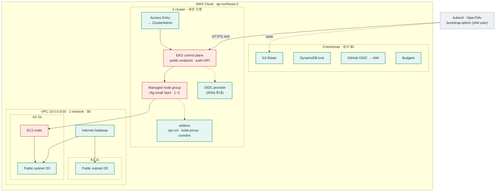

# EKS 2-cluster 아키텍처

> AWS EKS 학습 놀이터의 `2-cluster` 레이어 — 컨트롤플레인 + 관리형 노드그룹.
> 이 문서는 **살아있는 다이어그램 소스**다. 레이어/Stage가 바뀌면 여기부터 갱신한다.
> 라이브 렌더(줌·전체화면): 아티팩트 링크는 `.claude/CONTEXT.md` 참조.

`ap-northeast-2` · 핸드롤 OpenTofu · destroy-after-use. **빨간(과금) 노드는 `aws_eks_cluster`와 노드뿐**, 나머지는 $0.

## 리소스 구성 (생성 순서 = 의존 순서, destroy는 역순)

| # | 리소스 | 파일 | 하는 일 | 비용 |
|---|--------|------|---------|:----:|
| ① | IAM 클러스터 역할 + `AmazonEKSClusterPolicy` | `iam.tf` | 컨트롤플레인이 ENI 등 생성할 신원 (`eks.amazonaws.com`) | $0 |
| ② | `aws_eks_cluster` | `cluster.tf` | 컨트롤플레인 본체. public endpoint · `auth=API` | **$0.10/hr** |
| ③ | `aws_iam_openid_connect_provider` | `cluster.tf` | 클러스터 OIDC → IAM 등록 = **IRSA 토대** | $0 |
| ④ | IAM 노드 역할 + 정책 ×3 | `iam.tf` | 노드 조인·CNI·이미지풀 (`ec2.amazonaws.com`) | $0 |
| ⑤ | `aws_eks_node_group` | `nodes.tf` | 관리형 노드그룹 t4g.small Spot ×1 (min1/max2) | Spot ~$0.007/hr + EBS |
| ⑥ | `aws_eks_addon` ×3 | `addons.tf` | vpc-cni·kube-proxy·coredns — 없으면 노드 `Ready` 안 됨 | $0 |
| ⑦ | Access Entry + policy association | `access.tf` | bootstrap-admin → ClusterAdmin (신형 API) | $0 |

## 레이어별 상태

| 레이어 | 내용 | 상태 | 비용 |
|--------|------|------|:----:|
| `0-bootstrap` | S3 tfstate · DynamoDB 락 · GitHub OIDC · Budgets | 적용됨 (#283) | $0 |
| `1-network` | VPC 10.0.0.0/16 · IGW · 퍼블릭 서브넷 ×2 (NAT 회피) | 적용됨 (#285) | $0 |
| `2-cluster` | 컨트롤플레인 · 노드그룹 · OIDC · 애드온 · Access Entry | 코드 완성 · plan 통과 · **apply 대기** | ~$0.11/hr |

## 비용 수명주기

- **apply → 실습 → 자리 뜰 때 `tofu destroy`** = 다시 $0.
- 안 부수면 ~$0.11/hr(하루 ~$2.6) 계속 샌다 → 매 세션 destroy가 규율.
- `tofu plan` 기준 **14개 생성**(역할2 · 정책첨부4 · 클러스터1 · OIDC1 · 노드그룹1 · 애드온3 · 엔트리1 · 연결1).
