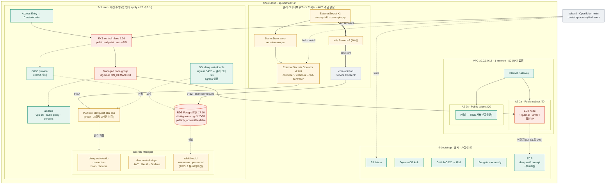
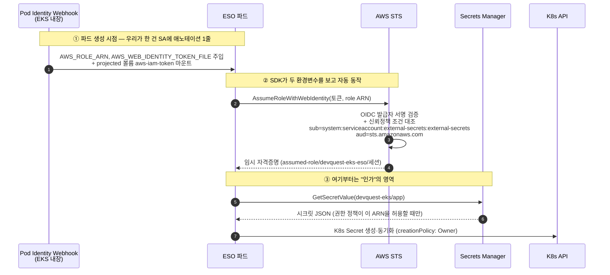
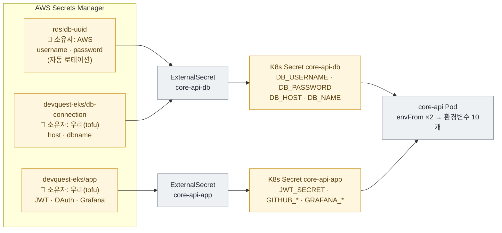

# EKS 2-cluster 아키텍처 (Stage 2 기준)

> AWS EKS 학습 놀이터의 `2-cluster` 레이어 — 컨트롤플레인 + 노드그룹 + **RDS + Secrets Manager + IRSA**.
> 이 문서는 **살아있는 다이어그램 소스**다. 레이어/Stage가 바뀌면 여기부터 갱신한다.
>
> 최종 갱신: 2026-07-28 (Stage 2 완료, PR #339 실측 반영)
>
> ### 🔄 갱신 시 두 벌을 함께 고친다
> | | 파일 | 용도 |
> |---|---|---|
> | ① | **이 문서** (`eks-2-cluster.md`) | repo·PR·블로그용. GitHub이 mermaid를 자동 렌더 |
> | ② | `eks-2-cluster.artifact.html` | 라이브 아티팩트 소스 (줌·전체화면·과금 색구분) |
>
> **② 재발행 방법** — Artifact 도구에 **반드시 `url`을 함께 넘긴다**:
> `https://claude.ai/code/artifact/0d4a3aa3-74eb-46c3-a598-96228686b311`
> ⚠️ `url` 없이 발행하면 **새 URL이 만들어져** CONTEXT·문서의 링크가 죽은 페이지를 가리키게 된다.
> (파일 경로가 바뀌었어도 `url`만 맞으면 같은 페이지가 갱신된다.)

`ap-northeast-2` · 핸드롤 OpenTofu · destroy-after-use.
**빨간(과금) 노드는 컨트롤플레인 · 노드 · RDS 3개**, 나머지는 $0 또는 무시 가능.

---

## 1. 인프라 전경

```mermaid
flowchart TB
  dev["kubectl · OpenTofu · helm<br/>bootstrap-admin (IAM user)"]

  subgraph cloud["AWS Cloud · ap-northeast-2"]
    direction TB

    subgraph boot["0-bootstrap · 상시 · 사실상 $0"]
      direction LR
      s3["S3 tfstate"]
      ddb["DynamoDB lock"]
      ghoidc["GitHub OIDC → IAM"]
      bud["Budgets + Anomaly"]
      ecr["ECR<br/>devquest/core-api<br/>~$0.02/월"]
    end

    subgraph vpc["VPC 10.0.0.0/16 · 1-network · $0 (NAT 없음)"]
      direction TB
      igw["Internet Gateway"]
      subgraph az1["AZ 2a · Public subnet /20"]
        n1["EC2 node<br/>t4g.small · arm64<br/>공인 IP"]
      end
      subgraph az2["AZ 2c · Public subnet /20"]
        sn2["(예비 — RDS 서브넷그룹용)"]
      end
    end

    subgraph c2["2-cluster · 세션 수명 (한 번의 apply = 26 리소스)"]
      direction TB
      cp["EKS control plane 1.36<br/>public endpoint · auth=API"]
      oidc["OIDC provider<br/>= IRSA 토대"]
      ng["Managed node group<br/>t4g.small ON_DEMAND ×1"]
      addons["addons<br/>vpc-cni · kube-proxy · coredns"]
      access["Access Entry → ClusterAdmin"]
      esorole["IAM role: devquest-eks-eso<br/>(IRSA · 시크릿 3개만 읽기)"]
      rds[("RDS PostgreSQL 17.10<br/>db.t4g.micro · gp3 20GB<br/>publicly_accessible=false")]
      sgrds["SG: devquest-eks-rds<br/>ingress 5432 ← 클러스터 SG<br/>egress 없음"]
      subgraph sm["Secrets Manager"]
        direction LR
        smdb["devquest-eks/db-connection<br/>host · dbname"]
        smapp["devquest-eks/app<br/>JWT · OAuth · Grafana"]
        smrds["rds!db-uuid<br/>username · password<br/>(AWS 소유·로테이션)"]
      end
    end

    subgraph k8s["클러스터 내부 (K8s 오브젝트 · AWS 과금 없음)"]
      direction TB
      eso["External Secrets Operator v2.8.0<br/>controller · webhook · cert-controller"]
      store["SecretStore: aws-secretsmanager"]
      es["ExternalSecret ×2<br/>core-api-db · core-api-app"]
      ksec["K8s Secret ×2 (10키)"]
      app["core-api Pod<br/>Service ClusterIP"]
    end
  end

  dev -->|"HTTPS 443"| cp
  dev -.->|"state"| s3
  dev -.->|"helm install"| eso
  igw --> az1
  igw --> az2
  cp --> ng
  ng --> n1
  ng -.-> addons
  cp -.-> oidc
  access --> cp
  oidc -.->|"신뢰"| esorole
  esorole -.->|"읽기 허용"| sm
  eso -->|"IRSA"| esorole
  store --> eso
  es --> store
  es ==> ksec
  ksec ==>|"envFrom"| app
  app -->|"5432 · sslmode=require"| rds
  sgrds -.->|"보호"| rds
  n1 -.->|"이미지 pull (노드 IAM)"| ecr
  rds -.->|"생성"| smrds

  classDef bill fill:#fdeae5,stroke:#d8452f,stroke-width:1.5px,color:#5a1e14;
  classDef free fill:#e6f5ef,stroke:#0e8a6f,stroke-width:1.5px,color:#0c3b32;
  classDef info fill:#eef1f4,stroke:#8a94a3,color:#232a33;
  classDef sec fill:#fff6e0,stroke:#c8901a,stroke-width:1.5px,color:#5a4210;
  class cp,ng,n1,rds bill;
  class s3,ddb,ghoidc,bud,ecr,igw,sn2,oidc,access,addons,sgrds free;
  class smdb,smapp,smrds,esorole,eso,store,es,ksec sec;
  class dev,app info;
```

---

## 2. IRSA — 파드가 정적 키 없이 AWS를 부르는 경로

**Stage 2에서 새로 배우는 핵심.** 위 그림의 `eso → esorole → Secrets Manager` 구간을 펼친 것.

```mermaid
sequenceDiagram
  autonumber
  participant W as Pod Identity Webhook<br/>(EKS 내장)
  participant P as ESO 파드
  participant STS as AWS STS
  participant SM as Secrets Manager
  participant K as K8s API

  Note over W,P: ① 파드 생성 시점 — 우리가 한 건 SA에 애노테이션 1줄
  W->>P: AWS_ROLE_ARN, AWS_WEB_IDENTITY_TOKEN_FILE 주입<br/>+ projected 볼륨 aws-iam-token 마운트

  Note over P,STS: ② SDK가 두 환경변수를 보고 자동 동작
  P->>STS: AssumeRoleWithWebIdentity(토큰, role ARN)
  STS->>STS: OIDC 발급자 서명 검증<br/>+ 신뢰정책 조건 대조<br/>sub=system:serviceaccount:external-secrets:external-secrets<br/>aud=sts.amazonaws.com
  STS-->>P: 임시 자격증명 (assumed-role/devquest-eks-eso/세션)

  Note over P,SM: ③ 여기부터는 "인가"의 영역
  P->>SM: GetSecretValue(devquest-eks/app)
  SM-->>P: 시크릿 JSON (권한 정책이 이 ARN을 허용할 때만)

  P->>K: K8s Secret 생성·동기화 (creationPolicy: Owner)
```

### 두 실패 모드를 반드시 구분한다

| 에러 | 어느 단계 | 원인 |
|---|---|---|
| `Not authorized to perform sts:AssumeRoleWithWebIdentity` | ② | 신뢰정책 `sub`/`aud` 불일치. **IRSA 최다 실패 지점** |
| `AccessDeniedException ... no identity-based policy allows` | ③ | assume는 성공, 권한 정책/ARN 문제 |

> 🔑 후자의 에러 주체는 `arn:aws:sts::<account>:assumed-role/devquest-eks-eso/<세션>`으로 찍힌다.
> **`assumed-role/`로 시작한다는 것 자체가 ②를 통과했다는 증거**다. 여기서 신뢰정책을 의심하면 엉뚱한 데를 판다.

### 왜 노드 IAM 역할을 쓰지 않나

노드 역할을 쓰면 **같은 노드의 모든 파드가 같은 권한**을 갖는다 — 경계가 *노드* 단위다.
IRSA는 그 경계를 **ServiceAccount** 단위로 좁힌다. 여기선 ESO만 시크릿 3개를 읽을 수 있고,
같은 노드의 `core-api` 파드는 Secrets Manager에 접근할 수 없다.

> 단, **ECR 이미지 pull은 여전히 노드 IAM 역할**(`AmazonEC2ContainerRegistryReadOnly`)로 한다.
> kubelet이 파드보다 먼저 동작해야 하므로 IRSA를 쓸 수 없기 때문. 그래서 `imagePullSecret`이 없어도 pull이 된다.

---

## 3. 시크릿이 두 갈래인 이유

```mermaid
flowchart LR
  subgraph aws["AWS Secrets Manager"]
    r["rds!db-uuid<br/>👤 소유자: AWS<br/>username · password<br/>(자동 로테이션)"]
    d["devquest-eks/db-connection<br/>👤 소유자: 우리(tofu)<br/>host · dbname"]
    a["devquest-eks/app<br/>👤 소유자: 우리(tofu)<br/>JWT · OAuth · Grafana"]
  end

  esdb["ExternalSecret<br/>core-api-db"]
  esapp["ExternalSecret<br/>core-api-app"]
  sdb["K8s Secret core-api-db<br/>DB_USERNAME · DB_PASSWORD<br/>DB_HOST · DB_NAME"]
  sapp["K8s Secret core-api-app<br/>JWT_SECRET · GITHUB_* · GRAFANA_*"]
  pod["core-api Pod<br/>envFrom ×2 → 환경변수 10개"]

  r --> esdb
  d --> esdb
  a --> esapp
  esdb --> sdb
  esapp --> sapp
  sdb --> pod
  sapp --> pod

  classDef sec fill:#fff6e0,stroke:#c8901a,color:#5a4210;
  classDef info fill:#eef1f4,stroke:#8a94a3,color:#232a33;
  class r,d,a,sdb,sapp sec;
  class esdb,esapp,pod info;
```

- **`core-api-db`가 두 곳을 읽는 이유**: `manage_master_user_password = true`로 AWS가 만든 시크릿에는
  **크리덴셜만 있고 접속 좌표(host/dbname)가 없다.** 그래서 좌표는 tofu가 따로 만들고 ExternalSecret이 합성한다.
- **소유자별로 쪼갠 이유**: 자동 로테이션되는 값(AWS)과 수동 값(우리)을 한 덩어리에 섞으면,
  Stage 3에서 DB만 in-cluster로 갈아끼울 때 앱 시크릿까지 건드려야 한다.
- ⚠️ `DB_HOST`에는 **포트가 없다**. jdbc-url이 `jdbc:postgresql://${DB_HOST}/${DB_NAME}` 형태라
  Terraform에서 RDS의 **`.address`**(포트 없음)를 쓴다. `.endpoint`는 `host:5432`라 URL이 깨진다.

---

## 4. 리소스 구성 (생성 순서 = 의존 순서, destroy는 역순)

`tofu plan` 기준 **26개 생성**.

| # | 리소스 | 파일 | 하는 일 | 비용 |
|---|--------|------|---------|:----:|
| ① | IAM 클러스터 역할 + `AmazonEKSClusterPolicy` | `iam.tf` | 컨트롤플레인이 ENI 등 생성할 신원 | $0 |
| ② | `aws_eks_cluster` | `cluster.tf` | 컨트롤플레인 본체. public endpoint · `auth=API` | **$0.10/hr** |
| ③ | `aws_iam_openid_connect_provider` | `cluster.tf` | 클러스터 OIDC → IAM 등록 = **IRSA 토대** | $0 |
| ④ | IAM 노드 역할 + 정책 ×3 | `iam.tf` | 노드 조인·CNI·**ECR 이미지풀** | $0 |
| ⑤ | `aws_eks_node_group` | `nodes.tf` | t4g.small **ON_DEMAND** ×1 (min1/max2) | **$0.0208/hr** + EBS |
| ⑥ | `aws_eks_addon` ×3 | `addons.tf` | vpc-cni·kube-proxy·coredns — 없으면 노드 `Ready` 안 됨 | $0 |
| ⑦ | Access Entry + policy association | `access.tf` | bootstrap-admin → ClusterAdmin (신형 API) | $0 |
| ⑧ | DB 서브넷그룹 · 보안그룹 · 인그레스 규칙 | `rds.tf` | 5432를 **클러스터 SG 참조**로만 개방. egress 없음(NAT 불필요) | $0 |
| ⑨ | `aws_db_instance` | `rds.tf` | PostgreSQL 17.10 · db.t4g.micro · gp3 20GB · 암호화 | **$0.025/hr** + 스토리지 |
| ⑩ | Secrets Manager 시크릿 ×2 + 버전 ×2 | `secrets.tf` | 접속 좌표 + 앱 시크릿. `recovery_window_in_days=0` | $0.40/개/월 |
| ⑪ | `random_password` | `secrets.tf` | JWT 키 (세션마다 새로 생성, prod와 무관) | $0 |
| ⑫ | IRSA 역할 + 정책 + 연결 | `irsa-eso.tf` | ESO SA 전용. 시크릿 **정확히 3개 ARN**만 (와일드카드 0) | $0 |

> **⑤가 SPOT이 아닌 이유**: 신규 계정은 **Spot vCPU 쿼터가 0**이라 SPOT이면 apply가 실패한다(#314 실측).
> 스팟 학습을 하려면 쿼터 증액 후 `var.node_capacity_type=SPOT`.

> **⑨가 왜 `2-cluster`에 있나**: 자동 정리 장치(리퍼)가 하드코딩된 `2-cluster`에서만 `tofu destroy`를
> 돌린다. RDS를 별도 레이어로 빼면 리퍼 사각지대가 되어 **영구 과금** 위험이 생긴다.
> "깔끔한 레이어 분리"보다 **안전장치 사정권**을 택한 것.

---

## 5. 레이어별 상태

| 레이어 | 내용 | 상태 | 비용 |
|--------|------|------|:----:|
| `0-bootstrap` | S3 tfstate · DynamoDB 락 · GitHub OIDC · Budgets · **ECR** | 적용됨 (#283, ECR #322) | ~$0.02/월 (ECR 저장) |
| `1-network` | VPC 10.0.0.0/16 · IGW · 퍼블릭 서브넷 ×2 (NAT 회피) | 적용됨 (#285) | $0 |
| `2-cluster` | 컨트롤플레인 · 노드그룹 · OIDC · 애드온 · **RDS · 시크릿 · IRSA** | **왕복 실증 완료** (#316 Stage 0 · #324 Stage 1 · **#339 Stage 2**) | ~$0.15/hr |

---

## 6. 비용 수명주기

- **apply → 실습 → `tofu destroy`** = 다시 $0. 안 부수면 ~$0.15/hr(하루 ~$3.6) 계속 샌다.
- **비용의 65%는 여전히 컨트롤플레인**($0.10/hr). RDS를 추가해도 시간당 증분은 $0.028(18%)뿐.
  → 아낄 대상은 "어떤 리소스를 쓰느냐"가 아니라 **"몇 분 켜두느냐"**다.

| 세션 | 리소스 | 벽시계 | 비용 |
|---|---|---|---|
| 2026-07-24 Stage 0 | 14 | ~50분 | ~$0.10 |
| 2026-07-27 Stage 1 | 14 | ~20분 | ~$0.05 |
| **2026-07-28 Stage 2** | **26** | **26분 35초** | **≈$0.06** |

> 리소스를 86% 늘렸는데 비용은 07-24보다 **낮다** — destroy를 미루지 않았고, 대기 시간에
> 다른 작업을 병렬로 처리해 벽시계 자체가 짧았기 때문.

### 남는 것 / 사라지는 것

| destroy 후 | 대상 |
|---|---|
| **사라짐** | 컨트롤플레인 · 노드 · RDS(스냅샷 0) · Secrets Manager 3개(**AWS 관리형 포함, 실측 확인**) |
| **남음** | ECR 이미지(`0-bootstrap` 소유 — 의도적) · S3 tfstate · Budgets |

---

## 7. Stage 3 예고 — 이 그림이 어떻게 바뀌나

| 바뀌는 것 | 영향 |
|---|---|
| RDS ➜ **in-cluster Postgres StatefulSet** | 빨간 노드 하나가 사라지고, 대신 **PVC → EBS**가 생긴다 |
| **EBS CSI 드라이버 + StorageClass** 추가 | 애드온이 하나 늘고, IRSA 역할이 하나 더 필요하다 |
| ⚠️ **K8s가 AWS 리소스를 만들기 시작한다** | PVC가 만든 EBS는 **tofu state 밖** → destroy 전 `kubectl delete pvc --all -A` 필수 |
| ⚠️ 노드 파드 상한 **11** | 현재 8 사용(시스템 4 + ESO 3 + 앱 1). StatefulSet 여유 3개뿐 |

> `application-prod.yml`이 100% 환경변수 기반이라 **앱 코드·이미지 변경 0**으로 스왑된다.
> 그게 "관리형 ↔ 자체운영" 비교 실습을 가능하게 하는 전제다.
