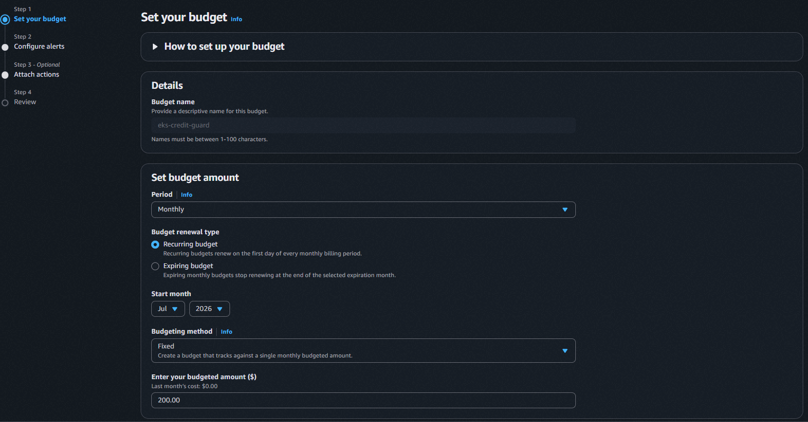
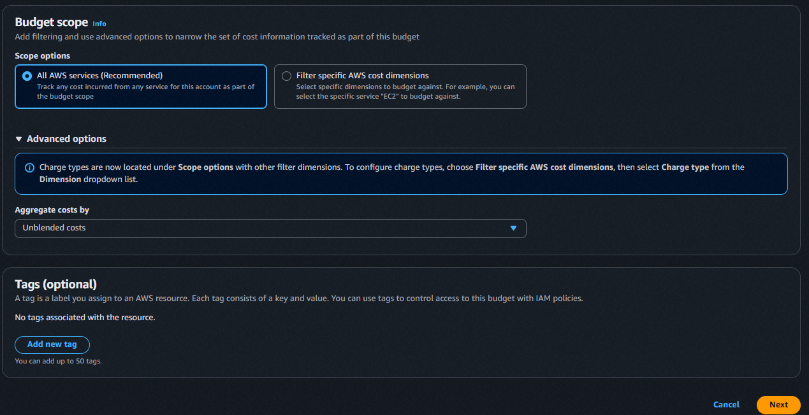
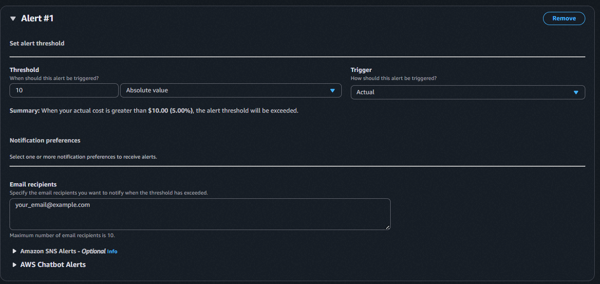

# AWS EKS 실습 — 정답 경로

> **용도**: "AWS free tier $200 EKS 실습기" 튜토리얼 소스. 처음 하는 사람이 **이 문서만 보고
> 처음부터 따라 하면 되는 상태**를 항상 유지한다.
>
> **유지 규칙** (상세: 루트 `CLAUDE.md` "EKS 작업 일지 규칙"):
> - 실패 시도는 여기 없다 (그건 `eks-migration-log.md`) — **동작 확인된 명령어만** 순서대로
> - 각 명령어에 기대 출력/확인 방법, 단계별 사전 조건(도구 버전·AWS 권한·앞 단계 산출물) 명시
> - 💰 비용 발생 시작 지점 표시 + 각 단계 cleanup 명령어
> - 방식이 바뀌면 과거 단계도 최종 방식으로 소급 갱신
> - 캡처는 사용자가 직접 — 필요 지점에 `<!-- 캡처 필요: ... -->` 자리표시, 아래 체크리스트로 추적
> - 터미널 출력은 이미지 금지, 텍스트 코드블록
>
> **최종 검증**: 이관 완료 후 클러스터 destroy → 이 문서만으로 처음부터 재현 성공해야 완료.

## 캡처 체크리스트

> 위치: `docs/images/eks-tutorial/`. 캡처 넣으면 완료 체크 + 본문 자리표시를 이미지 참조로 교체.
> ⚠️ = 휘발성 (지금 아니면 못 찍음)

| 파일명 | 필요한 화면 | 완료 |
|--------|------------|:----:|
| step-00-credits.png | ⚠️ Billing → Credits: Total remaining **$200.00 / 사용 $0.00** + Active credits 6건 목록 ($100 Free Tier + $20×5 Explore AWS). 크레딧 소비 시작(Stage 0 apply) 후엔 재현 불가 | ☐ |
| step-00-budget-amount.png | Set your budget — name·Monthly/Recurring·Fixed·$200 | ☑ |
| step-00-budget-scope.png | Budget scope — All AWS services / Unblended costs | ☑ |
| step-00-budget-alerts.png | 예산 알림 설정 화면 — Threshold **Absolute value** 10/50/150, Trigger **Actual**, Email recipients (자리표시 `your_email@example.com`로 캡처 권장) | ☑ |
| step-00-budgets.png | Budgets 목록에 `eks-credit-guard` + 임계값 알림 표시 | ☐ |
| step-00-anomaly.png | Cost Anomaly Detection 모니터 생성 완료 화면 | ☐ |

> **remote 세션 이미지 전송법** (확정): 채팅 인라인 이미지·파일은 실행 디스크에 안 닿고 클립보드도
> 격리됨. → **캡처 → GitHub 댓글창에 Ctrl+V(자동 업로드) → 생성된 URL을 채팅에 전달 → `gh` 토큰으로
> 다운로드**. (익명 접근은 404, `Authorization: token $(gh auth token)` 헤더 필요.)

## 사전 조건 (전체 공통)

<!-- 확정 시 기입: OS/셸, OpenTofu 버전, AWS CLI 버전, kubectl 버전, IAM 권한 -->

- AWS 계정: 신규 계정 — 생성 완료 (2026-07-16)
- 크레딧 (07-16 콘솔 실측): **$200.00 = $100 (AWS Free Tier 기본) + $20×5 (Explore AWS 활동:
  EC2·Bedrock·Lambda·Budgets·RDS)**. 전 건 만료 **2027-07-15** (가입 +1년). 사용 $0.00
- AWS Budgets 알림 + Cost Anomaly Detection 설정 (Step 0 — `tofu apply` 전 필수)

## Step 0 — AWS 비용 가드레일 (예산 알림 + 이상 탐지)

> **사전 조건**: AWS 계정 로그인 (신규 학습 계정이면 루트로 진행해도 무방).
> **왜 먼저 하나**: EKS는 시간당 과금이라, `tofu apply` 전에 폭주 감지 장치부터 건다.
> **💰 비용**: 예산은 계정당 **2개까지 무료**(이후 $0.02/budget/day). 이상 탐지는 무료. → 이 단계 과금 $0.

<!-- 캡처 필요: step-00-credits.png — Billing → Credits 페이지, Total remaining $200.00·Active credits 6건이 보이는 상태 (⚠️ Stage 0 apply 전에 확보) -->

### 0-1. 예산(Budget) 생성

Billing and Cost Management 콘솔 → 좌측 **Budgets** → **Create budget**

1. **Choose budget type**
   - Budget setup: **Customize (advanced)**
   - Budget types: **Cost budget - Recommended** → Next
2. **Set your budget**
   - Details → Budget name: `eks-credit-guard`
   - Set budget amount → Period **Monthly** / Budget renewal type **Recurring budget** /
     Budgeting method **Fixed** / Enter your budgeted amount **`200`** (= 크레딧 총액)

     
   - Budget scope → **All AWS services (Recommended)** / Aggregate costs by **Unblended costs**
     - ⚠️ **크레딧 제외는 신규 계정에서 지금 불가** — 아래 "함정 ①" 참조. 24h 뒤 편집으로 추가.

     
   - Next
3. **Configure alerts** → **Add alert threshold** 3개 (전부 아래처럼):

   | Threshold 값 | 단위 | Trigger | Email recipients |
   |:---:|---|---|---|
   | `10` | **Absolute value** | Actual | `<your-email>` |
   | `50` | **Absolute value** | Actual | `<your-email>` |
   | `150` | **Absolute value** | Actual | `<your-email>` |

   - ⚠️ **단위 반드시 `Absolute value`** — 기본값 `% of budgeted amount`이면 150이 **$300**(크레딧 $200 초과 → 영영 안 울림). "함정 ②" 참조.
   - 확인: Alert #1 Summary가 `When your actual cost is greater than $10.00 (5.00%)...`로 뜨면 정상.

     
4. **Attach actions** — Optional, 건너뛰기 → Next
5. **Review** → **Create budget**

<!-- 캡처 필요: step-00-budgets.png — Budgets 목록에 eks-credit-guard와 알림이 보이는 상태 -->

#### 함정 ① — 신규 계정은 크레딧 charge type을 아직 못 고른다
크레딧이 청구액을 $0으로 가려 알림이 안 울리는 것을 막으려면 원래
`Budget scope → Filter specific AWS cost dimensions → Dimension: Charge type → Excludes → Credit, Refund`로
크레딧/환불을 제외해야 한다. **그러나 계정 생성 직후엔** 이 Values 드롭다운이
`Data is not available. Please try to adjust the time period. If just enabled Cost Explorer,
data might not be ingested yet`를 띄우며 비어 있다 — Cost Explorer 데이터가 아직 수집 전(최대 24h).
→ **일단 All AWS services로 예산을 만들고, ~24h 뒤 예산을 편집해 이 필터를 추가한다.**
(첫 실제 과금은 Stage 0 `tofu apply` 때라 순서 여유 있음.)

#### 함정 ② — 알림 단위 기본값이 퍼센트다
Configure alerts의 Threshold 단위 기본값은 `% of budgeted amount`. 여기에 10/50/150을 넣으면
예산 $200 기준 **$20/$100/$300**이 된다 (150%=$300은 크레딧 초과라 무의미). 반드시 각 알림에서
단위를 **`Absolute value`**로 바꿔 10/50/150 = **$10/$50/$150 달러**가 되게 한다.

### 0-2. Cost Anomaly Detection (이상 탐지)

Billing 콘솔 좌측 **Cost Anomaly Detection** → **Create monitor**

<!-- 절차 확정 후 기입 — 진행 중 -->
<!-- 캡처 필요: step-00-anomaly.png — 모니터 생성 완료 화면 -->

### 0-3. Cleanup
- 예산·이상 탐지는 **삭제 불필요** (무료, 상시 유지가 목적). 학습 종료 후에도 남겨둔다.

## Step 1 — (예정) OpenTofu 설치 + 스캐폴딩

<!-- Stage 0 착수 시 기록 -->

## Step 8 — 2-cluster apply → 검증 → destroy 왕복 (첫 과금)

> ⚠️ **선행 단계(Step 1~7: tofu 설치 · 0-bootstrap backend · 1-network VPC · 2-cluster `.tf` 작성)는
> 아직 이 문서에 미작성.** 아래는 그 결과물이 준비된 상태에서 **실제로 동작 확인된 apply/destroy 명령
> 시퀀스**다. 정답 경로로 검증됨(2026-07-24). 선행 단계는 추후 채운다.

**이 단계가 하는 일**: EKS 컨트롤플레인 + 워커 노드 1대 + 애드온을 띄우고, kubectl로 노드가 뜬 걸
확인한 뒤, **곧바로 부순다**. "떴다 부순다"를 한 세션에 왕복하는 것이 destroy-after-use 규율의 핵심 —
클러스터를 켜둔 채 방치하는 시간이 곧 비용이기 때문이다(컨트롤플레인은 워크로드가 0이어도 $0.10/hr 고정).

### 8-0. 사전 조건
- `tofu`(OpenTofu) · `aws` CLI + 자격증명(`aws sts get-caller-identity` 성공) · **`kubectl`**
  - kubectl 미설치 시: `brew install kubectl`. 클러스터 K8s 버전과 클라이언트 버전을 맞추면 경고가 적다(여기선 1.36).
- 선행 레이어(`0-bootstrap`·`1-network`)가 이미 apply되어 S3 backend·VPC가 존재해야 함.
- **K8s 버전 재확인**(비용 $0): 핀한 버전이 아직 표준지원인지 apply 직전에 본다.
  ```bash
  aws eks describe-cluster-versions --region ap-northeast-2 \
    --query 'clusterVersions[?status==`STANDARD_SUPPORT`].[clusterVersion,endOfStandardSupportDate]' \
    --output table
  ```
  확인: 핀한 버전(예: 1.36)이 목록에 있고 종료일이 넉넉해야 함. **필터 필드는 `status`**(오타 시 빈 출력).

### 8-1. init + plan (비용 $0)
```bash
cd infra/aws-eks/2-cluster
tofu init          # S3 backend 재연결 + 프로바이더 로드
tofu plan          # 생성될 리소스 계획
```
확인: `Plan: 14 to add, 0 to change, 0 to destroy.` (컨트롤플레인·노드그룹·애드온3·OIDC·IAM역할2·정책4·access2)
- **과금 리소스는 2개뿐**: `aws_eks_cluster`(컨트롤플레인 $0.10/hr) + `aws_eks_node_group`(t4g.small ×1).
  나머지 12개는 IAM·RBAC·애드온으로 $0. plan에서 `capacity_type = "ON_DEMAND"` 확인
  (신규 계정은 Spot vCPU 쿼터가 0이라 SPOT이면 apply가 실패한다).

### 8-2. apply (★ 과금 시작)
```bash
tofu apply -auto-approve
```
확인: `Apply complete! Resources: 14 added.` — **약 10분**(컨트롤플레인 프로비저닝이 ~8분으로 대부분).
Outputs로 `cluster_endpoint`·`oidc_provider_arn`이 나온다. **이 순간부터 과금.** 자리를 뜨지 말 것.

### 8-3. 검증 — 노드 Ready (이 단계가 목표)
```bash
aws eks update-kubeconfig --name devquest-eks --region ap-northeast-2
kubectl get nodes -o wide
kubectl get pods -n kube-system
```
확인:
- 노드 1개 `STATUS=Ready`, `VERSION=v1.36.x`, 아키텍처 arm64(Graviton), `EXTERNAL-IP`에 공인 IP가 붙음
  (퍼블릭 서브넷 + 공인 IP = NAT Gateway를 피한 설계. NAT는 월 $32라 학습 클러스터에선 회피).
- `kube-system`에 `aws-node`(vpc-cni)·`coredns` ×2·`kube-proxy`가 전부 `Running`.

### 8-4. destroy (★ 과금 종료 — 검증 직후 즉시)
```bash
tofu destroy -auto-approve
```
확인: `Destroy complete! Resources: 14 destroyed.` — 약 5분(노드그룹 ~2분 → 컨트롤플레인 ~1.5분 → IAM).

### 8-5. teardown 전수 검증 (고아 리소스 = 계속 새는 비용)
```bash
tofu state list                                   # 비어 있어야 함
aws eks list-clusters --region ap-northeast-2     # 비어 있어야 함
aws ec2 describe-volumes --region ap-northeast-2 --filters "Name=status,Values=available" \
  --query 'Volumes[].VolumeId'                     # 미연결 EBS 없어야 함
aws elbv2 describe-load-balancers --region ap-northeast-2 \
  --query 'LoadBalancers[].LoadBalancerName'       # 고아 LB 없어야 함
aws ec2 describe-nat-gateways --region ap-northeast-2 \
  --filter "Name=state,Values=available"           # NAT 없어야 함
```
- ⚠️ **왜 육안 확인이 필요한가**: `tofu destroy`는 **state에 있는 것만** 지운다. 이번 범위엔 Ingress·PVC가
  없어 고아가 안 생기지만, **앱 배포 단계(ALB Ingress·EBS PVC)부터는 K8s가 만든 AWS 리소스가 state 밖에
  남아 계속 과금**된다. 그때는 destroy 전에 `kubectl delete ingress,pvc --all -A`를 먼저 해야 한다.
- EC2가 `terminated`로 잠시 보이는 건 정상(종료 인스턴스는 ~1시간 잔상만, 과금 없음).

### 비용 결산 (실측, 2026-07-24)
벽시계 apply-start ~ teardown-verified ≈ 50분(순수 compute는 apply 10분 + destroy 5분, 나머지 대기).
컨트롤플레인 ACTIVE ~40분 × $0.10/hr ≈ $0.07 + 노드 ~$0.01 = **총 ~$0.1 이하.** 실패해도 재생성이 사실상
공짜다 — **아낄 것은 크레딧이 아니라 "켜놓고 딴짓하는 시간".**
