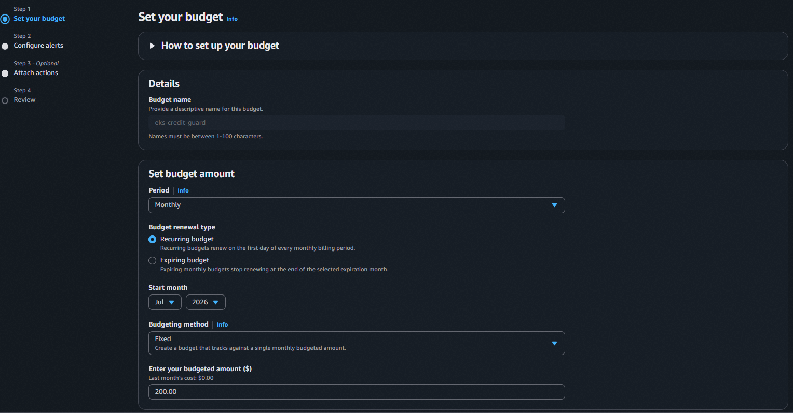
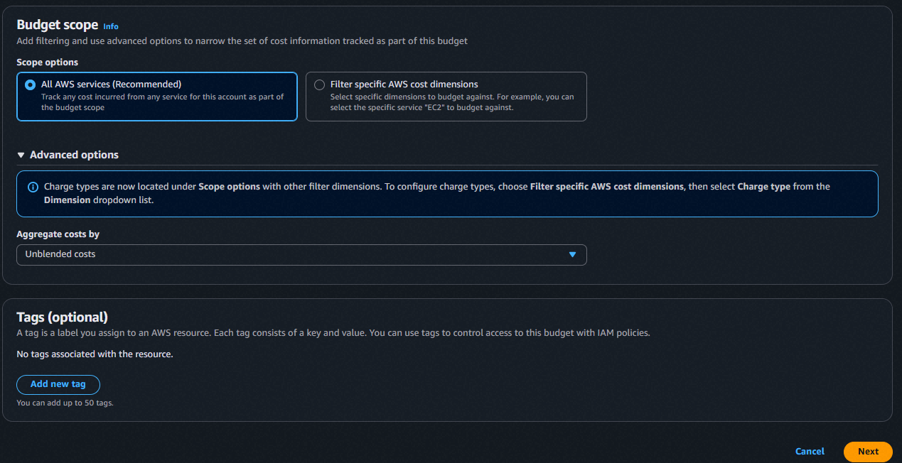
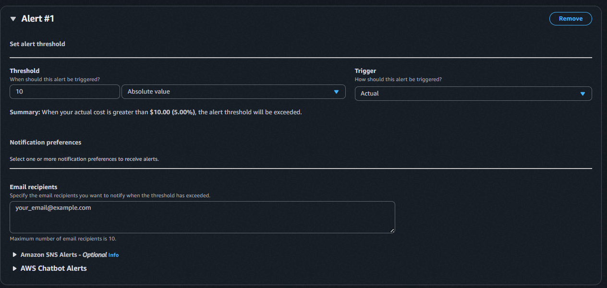

# AWS EKS 실습 — 정답 경로

> **용도**: "AWS free tier $200 EKS 실습기" 튜토리얼 소스. 처음 하는 사람이 **이 문서만 보고
> 처음부터 따라 하면 되는 상태**를 항상 유지한다.
>
> **유지 규칙** (상세: 루트 `CLAUDE.md` "EKS 작업 일지 규칙"):
> - 실패 시도는 여기 없다 (그건 `eks-migration-log.md`) — **동작 확인된 명령어만** 순서대로
> - 각 명령어에 기대 출력/확인 방법, 단계별 사전 조건(도구 버전·AWS 권한·앞 단계 산출물) 명시
> - 💰 비용 발생 시작 지점 표시 + 각 단계 cleanup 명령어
> - 방식이 바뀌면 과거 단계도 최종 방식으로 소급 갱신
> - 캡처는 사용자가 직접 — 필요 지점에 `<!-- 캡처 필요: ... -->` 자리표시, 아래 체크리스트로 추적
> - 터미널 출력은 이미지 금지, 텍스트 코드블록
>
> **최종 검증**: 이관 완료 후 클러스터 destroy → 이 문서만으로 처음부터 재현 성공해야 완료.

---

## ⚠️ 먼저 읽을 것 — 레이어와 스테이지는 1:1이 아니다

이 문서에서 가장 헷갈리기 쉬운 지점이라 앞에 둔다.

- **IaC 레이어**(`0-bootstrap` / `1-network` / `2-cluster`)는 **인프라를 나누는 단위**다.
- **Stage 0~5**는 **학습 마일스톤**이다. "무엇을 새로 이해했는가"로 나뉜다.

**둘은 겹치지 않는다.** `2-cluster` 레이어 하나가 EKS 클러스터 + RDS + Secrets Manager + IRSA를
**한 번의 `tofu apply`로 전부** 만든다. 그래서:

- Stage 0을 밟는 순간 RDS까지 같이 생긴다. "Stage 2에 가서야 DB가 생긴다"가 **아니다.**
- 아래 Stage 1·2는 **인프라를 더 만드는 단계가 아니라, 이미 만들어진 것을 K8s 쪽에서 쓰는 단계**다.

> **왜 이렇게 뒀나 (트레이드오프)**: RDS를 `3-data` 같은 별도 레이어로 빼는 게 구조적으로는 더 깔끔하다.
> 그런데 **자동 정리 장치(리퍼)가 하드코딩된 `2-cluster` 디렉토리에서만 `tofu destroy`를 돌린다.**
> RDS가 그 밖에 있으면, 사람이 destroy를 잊었을 때 클러스터만 지워지고 **RDS는 영구 과금**된다.
> → **"깔끔한 레이어 분리"보다 "안전장치 사정권"을 택했다.** 학습 계정에선 이 판단이 맞다.

---

## 캡처 체크리스트

> 위치: `docs/images/eks-tutorial/`. 캡처 넣으면 완료 체크 + 본문 자리표시를 이미지 참조로 교체.
> ⚠️ = 휘발성 (지금 아니면 못 찍음)

| 파일명 | 필요한 화면 | 완료 |
|--------|------------|:----:|
| ~~step-00-credits.png~~ | 🔴 **영구 소실.** Billing → Credits의 `$200.00 / 사용 $0.00` 화면은 Stage 0 apply(07-24)로 크레딧 소비가 시작되면서 **재현 불가**가 됐다. 대체: 현재 잔여 화면 + 아래 "사전 조건"의 실측 수치를 텍스트로 인용 | 🔴 |
| step-00-budget-amount.png | Set your budget — name·Monthly/Recurring·Fixed·$200 | ☑ |
| step-00-budget-scope.png | Budget scope — All AWS services / Unblended costs | ☑ |
| step-00-budget-alerts.png | 예산 알림 설정 화면 — Threshold **Absolute value** 10/50/150, Trigger **Actual**, Email recipients (자리표시 `your_email@example.com`로 캡처 권장) | ☑ |
| step-00-budgets.png | Budgets 목록에 `eks-credit-guard` + 임계값 알림 표시 | ☐ |
| step-00-anomaly.png | Cost Anomaly Detection 모니터 생성 완료 화면 | ☐ |
| stage-1-ecr-images.png | ECR → `devquest/core-api` 이미지 목록 — sha 태그 + `latest`, 크기(~166MB), 푸시 시각 | ☐ |
| stage-2-secrets-list.png | ⚠️ Secrets Manager 목록에 3개가 **동시에** 보이는 화면(`devquest-eks/db-connection` · `devquest-eks/app` · `rds!db-<uuid>`). **destroy하면 전부 사라진다** — 클러스터 살아있을 때만 가능 | ☐ |
| stage-2-rds-instance.png | ⚠️ RDS → `devquest-eks-db` 상세 — Status `Available`, Engine `PostgreSQL 17.10`, Class `db.t4g.micro`, Publicly accessible `No`. **destroy 후 재현 불가** | ☐ |
| stage-2-cost-explorer.png | Cost Explorer에서 세션 당일 비용 — 서비스별(EKS/EC2/RDS) 분해. **CE 반영은 ~24h 지연**되므로 세션 다음 날 촬영 | ☐ |

> 🔴 **휘발성 캡처를 놓친 사례가 이미 있다**(위 `step-00-credits.png`). 규칙을 만들어두고도 놓쳤다.
> **Stage 2의 ⚠️ 2건은 클러스터가 살아있는 30분 안에만 찍을 수 있다** — 다음 과금 세션에서 destroy 전에 확보할 것.

> **remote 세션 이미지 전송법** (확정): 채팅 인라인 이미지·파일은 실행 디스크에 안 닿고 클립보드도
> 격리됨. → **캡처 → GitHub 댓글창에 Ctrl+V(자동 업로드) → 생성된 URL을 채팅에 전달 → `gh` 토큰으로
> 다운로드**. (익명 접근은 404, `Authorization: token $(gh auth token)` 헤더 필요.)

---

## 사전 조건 (전체 공통)

**도구** (07-28 실측 조합, 이 버전들로 전 과정 검증됨):

| 도구 | 버전 | 설치 | 쓰이는 곳 |
|---|---|---|---|
| OpenTofu | v1.12.4 | `brew install opentofu` | 전 단계 |
| AWS CLI | 2.36.2 | `brew install awscli` | 전 단계 |
| kubectl | v1.36.3 | `brew install kubectl` | Stage 0~ |
| Helm | v4.2.3 | `brew install helm` | Stage 2 (ESO 설치) |

> **kubectl은 클러스터 K8s 버전과 맞추면 경고가 적다**(여기선 둘 다 1.36).
> 💡 **도구 공백은 실제 세션 직전이 아니라 준비 단계에서 드러난다** — 두 번 겪었다
> (Stage 0 직전 kubectl 미설치, Stage 2 직전 helm 미설치). 과금 시작 전에 위 4개를 한 번에 확인할 것:
> ```bash
> command -v tofu kubectl aws helm && aws sts get-caller-identity
> ```

**계정·크레딧**:
- AWS 계정: 신규 계정 (2026-07-16 생성)
- 크레딧 (07-16 콘솔 실측): **$200.00 = $100 (AWS Free Tier 기본) + $20×5 (Explore AWS 활동:
  EC2·Bedrock·Lambda·Budgets·RDS)**. 전 건 만료 **2027-01-15**. 개설 시점 사용 $0.00
- 🔴 **RDS 프리티어 없음** — 2025-07 이후 신규 계정은 프리티어가 아니라 크레딧 구조다.
  `aws freetier get-free-tier-usage`로 확인했고, RDS는 단가가 그대로 청구된다.
- AWS Budgets 알림 + Cost Anomaly Detection 설정 (아래 "비용 가드레일" — `tofu apply` 전 필수)

**크레딧 잔여를 정확히 보는 법** (⚠️ 함정 있음):

```bash
aws ce get-cost-and-usage --time-period Start=2026-07-01,End=2026-07-29 \
  --granularity MONTHLY --metrics UnblendedCost \
  --filter '{"Dimensions":{"Key":"RECORD_TYPE","Values":["Usage","Credit"]}}' \
  --group-by Type=DIMENSION,Key=RECORD_TYPE
```
```
Usage   0.3282654451
Credit -0.3282654047
```

> 🔴 **`RECORD_TYPE` 분리 없이 조회하면 크레딧이 상계돼 순액 `$0.00000004`만 나온다** —
> "아직 아무것도 안 썼네"로 오독하기 딱 좋다. 실사용량을 보려면 반드시 `Usage`로 필터할 것.

---

## 비용 가드레일 (예산 알림 + 이상 탐지) — apply 전 필수

> **사전 조건**: AWS 계정 로그인 (신규 학습 계정이면 루트로 진행해도 무방).
> **왜 먼저 하나**: EKS는 시간당 과금이라, `tofu apply` 전에 폭주 감지 장치부터 건다.
> **💰 비용**: 예산은 계정당 **2개까지 무료**(이후 $0.02/budget/day). 이상 탐지는 무료. → 이 단계 과금 $0.

### G-1. 예산(Budget) 생성

Billing and Cost Management 콘솔 → 좌측 **Budgets** → **Create budget**

1. **Choose budget type**
   - Budget setup: **Customize (advanced)**
   - Budget types: **Cost budget - Recommended** → Next
2. **Set your budget**
   - Details → Budget name: `eks-credit-guard`
   - Set budget amount → Period **Monthly** / Budget renewal type **Recurring budget** /
     Budgeting method **Fixed** / Enter your budgeted amount **`200`** (= 크레딧 총액)

     
   - Budget scope → **All AWS services (Recommended)** / Aggregate costs by **Unblended costs**
     - ⚠️ **크레딧 제외는 신규 계정에서 지금 불가** — 아래 "함정 ①" 참조. 24h 뒤 편집으로 추가.

     
   - Next
3. **Configure alerts** → **Add alert threshold** 3개 (전부 아래처럼):

   | Threshold 값 | 단위 | Trigger | Email recipients |
   |:---:|---|---|---|
   | `10` | **Absolute value** | Actual | `<your-email>` |
   | `50` | **Absolute value** | Actual | `<your-email>` |
   | `150` | **Absolute value** | Actual | `<your-email>` |

   - ⚠️ **단위 반드시 `Absolute value`** — 기본값 `% of budgeted amount`이면 150이 **$300**(크레딧 $200 초과 → 영영 안 울림). "함정 ②" 참조.
   - 확인: Alert #1 Summary가 `When your actual cost is greater than $10.00 (5.00%)...`로 뜨면 정상.

     
4. **Attach actions** — Optional, 건너뛰기 → Next
5. **Review** → **Create budget**

<!-- 캡처 필요: step-00-budgets.png — Budgets 목록에 eks-credit-guard와 알림이 보이는 상태 -->

#### 함정 ① — 신규 계정은 크레딧 charge type을 아직 못 고른다
크레딧이 청구액을 $0으로 가려 알림이 안 울리는 것을 막으려면 원래
`Budget scope → Filter specific AWS cost dimensions → Dimension: Charge type → Excludes → Credit, Refund`로
크레딧/환불을 제외해야 한다. **그러나 계정 생성 직후엔** 이 Values 드롭다운이
`Data is not available. Please try to adjust the time period. If just enabled Cost Explorer,
data might not be ingested yet`를 띄우며 비어 있다 — Cost Explorer 데이터가 아직 수집 전(최대 24h).
→ **일단 All AWS services로 예산을 만들고, ~24h 뒤 예산을 편집해 이 필터를 추가한다.**
(첫 실제 과금은 Stage 0 `tofu apply` 때라 순서 여유 있음.)

#### 함정 ② — 알림 단위 기본값이 퍼센트다
Configure alerts의 Threshold 단위 기본값은 `% of budgeted amount`. 여기에 10/50/150을 넣으면
예산 $200 기준 **$20/$100/$300**이 된다 (150%=$300은 크레딧 초과라 무의미). 반드시 각 알림에서
단위를 **`Absolute value`**로 바꿔 10/50/150 = **$10/$50/$150 달러**가 되게 한다.

### G-2. Cost Anomaly Detection (이상 탐지)

Billing 콘솔 좌측 **Cost Anomaly Detection** → **Create monitor**

<!-- 절차 확정 후 기입 — 진행 중 -->
<!-- 캡처 필요: step-00-anomaly.png — 모니터 생성 완료 화면 -->

### G-3. Cleanup
- 예산·이상 탐지는 **삭제 불필요** (무료, 상시 유지가 목적). 학습 종료 후에도 남겨둔다.

---

## (미작성) 레이어 스캐폴딩 — `0-bootstrap` · `1-network` · `2-cluster` `.tf` 작성

> ⚠️ **아직 이 문서에 미작성.** OpenTofu 설치 → S3 backend + DynamoDB 락 부트스트랩 →
> VPC/서브넷 → `2-cluster` `.tf` 작성까지가 여기 들어간다. 레포의 `infra/aws-eks/` 코드가
> 사실상의 정답이며, 아래 Stage 0부터는 **그 코드가 준비된 상태**를 전제한다.
>
> **재현 검증(이 문서만 보고 처음부터) 시 여기가 첫 번째 구멍이다.** 채울 때까지는 재현 검증 불가.

---

## Stage 0 — 클러스터 왕복 (★ 첫 과금)

**이 단계가 하는 일**: EKS 컨트롤플레인 + 워커 노드 1대 + 애드온 + (RDS·시크릿·IRSA)를 띄우고,
kubectl로 노드가 뜬 걸 확인한 뒤 **곧바로 부순다.**

"떴다 부순다"를 한 세션에 왕복하는 것이 destroy-after-use 규율의 핵심이다 — 클러스터를 켜둔 채
방치하는 시간이 곧 비용이기 때문이다(컨트롤플레인은 워크로드가 0이어도 **$0.10/hr 고정**).

> 💡 **처음이라면 Stage 0만 왕복해보고 끝내는 것을 권한다.** apply→검증→destroy를 손에 익힌 뒤
> Stage 1·2로 가는 편이, 과금 중에 처음 보는 명령을 더듬는 것보다 훨씬 싸다.

### 0-0. 사전 조건
- 위 "사전 조건"의 도구 4종 + 자격증명
- 선행 레이어(`0-bootstrap`·`1-network`)가 이미 apply되어 S3 backend·VPC가 존재해야 함
- **K8s 버전 재확인**(비용 $0): 핀한 버전이 아직 표준지원인지 apply 직전에 본다.
  ```bash
  aws eks describe-cluster-versions --region ap-northeast-2 \
    --query 'clusterVersions[?status==`STANDARD_SUPPORT`].[clusterVersion,endOfStandardSupportDate]' \
    --output table
  ```
  확인: 핀한 버전(예: 1.36)이 목록에 있고 종료일이 넉넉해야 함. **필터 필드는 `status`**(오타 시 빈 출력).
  - 실측(07-28): 1.36은 2027-08-02까지. **1.33은 2026-07-29 종료** — 낮은 버전에 핀해뒀다면 여기서 걸린다.

- **RDS 엔진 버전·인스턴스 클래스 실존 확인** (apply 최다 실패 지점, 비용 $0):
  ```bash
  aws rds describe-db-engine-versions --engine postgres --engine-version 17.10 \
    --region ap-northeast-2 --query 'DBEngineVersions[].EngineVersion' --output text
  aws rds describe-orderable-db-instance-options --engine postgres --engine-version 17.10 \
    --db-instance-class db.t4g.micro --region ap-northeast-2 \
    --query 'OrderableDBInstanceOptions[].DBInstanceClass' --output text
  ```
  > **왜 미리 보나**: 코드에만 있고 AWS엔 없는 버전이면 apply가 **RDS 생성 단계에서** 죽는다.
  > 그땐 이미 EKS가 만들어져 **과금 중**이라 제일 비싼 실패다. ARM 인스턴스는 리전·버전별로
  > 주문 불가한 조합이 있으니 클래스도 함께 본다.

### 0-1. init + plan (비용 $0)
```bash
tofu -chdir=infra/aws-eks/2-cluster init
tofu -chdir=infra/aws-eks/2-cluster plan -out=/tmp/stage.tfplan
```
확인: **`Plan: 26 to add, 0 to change, 0 to destroy.`**

구성 (26개):

| 분류 | 개수 | 과금 |
|---|:--:|---|
| EKS 컨트롤플레인 | 1 | **$0.10/hr** |
| 관리형 노드그룹 (t4g.small ×1) | 1 | **$0.0208/hr** + EBS 20GB |
| 애드온 (vpc-cni·coredns·kube-proxy) | 3 | $0 |
| OIDC 공급자 · IAM 역할 3 · 정책/연결 6 · access entry 2 | 12 | $0 |
| **RDS** (인스턴스·서브넷그룹·보안그룹·인그레스) | 4 | **$0.025/hr** + gp3 20GB |
| **Secrets Manager** (시크릿 2 + 버전 2) | 4 | $0.40/개/월 |
| `random_password` (JWT 키) | 1 | $0 |

- plan에서 **`capacity_type = "ON_DEMAND"`** 확인 — 신규 계정은 Spot vCPU 쿼터가 0이라 SPOT이면 apply가 실패한다.
- 📌 **과거 기록과 다른 점**: 07-24 시점엔 `14 to add`였다. Stage 2에서 RDS·시크릿·IRSA 12개가
  같은 레이어에 추가돼 26이 됐다. 문서 상단 "레이어와 스테이지는 1:1이 아니다" 참조.

### 0-2. apply (★ 과금 시작)
```bash
tofu -chdir=infra/aws-eks/2-cluster apply -auto-approve /tmp/stage.tfplan
```
확인: `Apply complete! Resources: 26 added.` — **약 12~15분.**

단계별 실측 소요 (07-28):

| 리소스 | 소요 |
|---|---|
| EKS 컨트롤플레인 | ~6분 |
| 노드그룹 | 2분 48초 |
| 애드온 vpc-cni·kube-proxy | 55초 / coredns 24초 |
| **RDS db.t4g.micro** | **4분 50초** |

> ⚠️ **RDS는 EKS와 병렬로 만들어지지 않는다.** RDS 보안그룹의 인그레스 규칙이 **EKS 클러스터
> 보안그룹 ID를 참조**하기 때문에 `클러스터 → 보안그룹 → RDS` 의존 사슬이 생겨 직렬화된다.
> 즉 RDS 시간은 EKS 시간에 **더해진다.**

**이 순간부터 과금. 자리를 뜨지 말 것.**

#### 함정 — apply가 "멈춘 것처럼" 보일 때

OpenTofu는 **리소스 에러를 즉시 출력하지 않고 apply 종료 시점에 모아서 낸다.** 그래서 실패한
리소스가 `Creating...`에 머물러 있는 것처럼 보인다. 게다가 `tofu state list`도 apply 중엔
pre-apply 상태(0건)라 진단에 쓸 수 없다.

→ **CloudTrail 이벤트 원문**으로 확인한다:
```bash
aws cloudtrail lookup-events --region ap-northeast-2 \
  --lookup-attributes AttributeKey=EventName,AttributeValue=CreateSecurityGroup \
  --max-results 5 --output json \
  | ruby -rjson -e 'JSON.parse(STDIN.read)["Events"].each{|ev| e=JSON.parse(ev["CloudTrailEvent"]); puts "#{e["eventTime"]} err=#{e["errorCode"].inspect} #{e["errorMessage"].to_s[0,200]}"}'
```
> 🔴 **`lookup-events`의 요약 필드 `ErrorCode`는 `None`으로 나온다** — 요약만 보면 "정상 호출"로
> 오독한다. 반드시 `CloudTrailEvent` **원문 JSON**을 파싱해야 `errorCode`가 보인다.
>
> 참고로 IAM은 글로벌 서비스라 **이벤트가 `us-east-1`에 기록**된다. IAM 관련 실패를 볼 땐 리전을 바꿀 것.

#### 함정 — `description`에 한글을 쓰면 apply가 깨진다 (도구가 못 잡는다)

`tofu validate`·`tofu plan`·`tfsec`이 **셋 다 통과시킨다.** AWS API를 호출하지 않기 때문이다.

```
InvalidParameterValue: Value (...) for parameter GroupDescription is invalid.
  Character sets beyond ASCII are not supported.

ValidationError: Value at 'description' failed to satisfy constraint:
  Member must satisfy regular expression pattern: [	

 -~¡-ÿ]*
```

제약은 **서비스마다 다르다** (같은 apply 안에서 대조 확인):

| 서비스 | 한글 description |
|---|:--:|
| EC2 보안그룹 / 인그레스 규칙 | ❌ |
| IAM 역할 / 정책 | ❌ |
| Secrets Manager | ✅ |
| ECR lifecycle policy | ✅ |

- `resource` 블록의 `description`만 위험하다. `variable`/`output`의 `description`은
  **로컬 메타데이터**라 AWS로 안 가므로 한글 무방.
- 검사:
  ```bash
  grep -rnP 'description\s*=.*[^\x00-\x7F]' --include='*.tf' infra/
  ```

### 0-3. 검증 — 노드 Ready
```bash
aws eks update-kubeconfig --name devquest-eks --region ap-northeast-2
kubectl get nodes -o wide
kubectl get pods -n kube-system
```
확인:
- 노드 1개 `STATUS=Ready`, `VERSION=v1.36.x`, 아키텍처 arm64(Graviton), `EXTERNAL-IP`에 공인 IP가 붙음
  (퍼블릭 서브넷 + 공인 IP = NAT Gateway를 피한 설계. NAT는 월 $32라 학습 클러스터에선 회피).
- `kube-system`에 `aws-node`(vpc-cni)·`coredns` ×2·`kube-proxy`가 전부 `Running`.

**노드에 파드가 몇 개나 들어가나** (Stage 1·2에서 중요해진다):
```bash
kubectl get node -o jsonpath='{.items[0].status.allocatable.pods}'
```
확인: **`11`**

> **왜 11인가**: EKS VPC CNI는 파드에 **VPC의 실제 IP**를 준다. 인스턴스 타입마다 붙일 수 있는
> ENI 수와 ENI당 IPv4 수가 정해져 있고, `t4g.small`은 **ENI 3개 × IPv4 4개**다.
> 각 ENI의 첫 IP는 ENI 자체가 쓰므로 `3 × (4-1) + 2 = 11`.
> 이 계산이 실측과 정확히 일치한다. **시스템 파드 4개(aws-node·kube-proxy·coredns×2)를 빼면 여유는 7개.**

### 0-4. destroy (★ 과금 종료 — 검증 직후 즉시)

Stage 1·2로 이어갈 게 아니면 **바로 부순다.**

```bash
tofu -chdir=infra/aws-eks/2-cluster destroy -auto-approve
```
확인: `Destroy complete! Resources: 26 destroyed.` — **약 4분 30초.**
(노드그룹 2분 16초 · RDS 3분 53초 · 컨트롤플레인 2분 9초 — 병렬로 진행)

### 0-5. teardown 전수 검증 (고아 리소스 = 계속 새는 비용)

```bash
R=ap-northeast-2
tofu -chdir=infra/aws-eks/2-cluster state list      # 비어 있어야 함
aws eks list-clusters --region $R
aws elbv2 describe-load-balancers --region $R --query 'LoadBalancers[].LoadBalancerName'
aws ec2 describe-volumes --region $R --filters Name=status,Values=available --query 'Volumes[].VolumeId'
aws ec2 describe-nat-gateways --region $R --filter Name=state,Values=available
aws ec2 describe-instances --region $R --filters Name=instance-state-name,Values=running \
  --query 'Reservations[].Instances[].InstanceId'

# ── RDS 계열 (인스턴스가 사라져도 스냅샷은 남아 과금된다) ──
aws rds describe-db-instances --region $R --query 'DBInstances[].DBInstanceIdentifier'
aws rds describe-db-snapshots --region $R --snapshot-type manual    --query 'DBSnapshots[].DBSnapshotIdentifier'
aws rds describe-db-snapshots --region $R --snapshot-type automated --query 'DBSnapshots[].DBSnapshotIdentifier'
aws rds describe-db-subnet-groups --region $R --query 'DBSubnetGroups[].DBSubnetGroupName'

# ── Secrets Manager (--include-planned-deletion 없으면 "삭제 대기"가 안 보인다) ──
aws secretsmanager list-secrets --region $R --include-planned-deletion \
  --query 'SecretList[].{Name:Name,Deleted:DeletedDate}'
```

**전부 비어 있어야 한다.** 실측(07-28) 결과 전 항목 0건.

- ⚠️ **왜 육안 확인이 필요한가**: `tofu destroy`는 **state에 있는 것만** 지운다.
  Stage 3부터 생기는 **ALB Ingress·EBS PVC는 K8s가 만든 것이라 state 밖**이며, destroy 후에도
  남아 계속 과금된다. 그때는 destroy 전에 `kubectl delete ingress,pvc --all -A`를 먼저 해야 한다.
- ✅ **RDS 마스터 시크릿은 자동 정리된다** (실측 확인): `manage_master_user_password = true`로
  AWS가 만든 `rds!db-<uuid>` 시크릿은 인스턴스 삭제와 함께 **완전히 사라진다.**
  복구창 좀비도, 이름 점유도 남지 않는다.
- 우리가 만든 시크릿 2개는 코드에서 **`recovery_window_in_days = 0`** 으로 둬서 즉시 소멸한다.
  기본값(30일)이면 시크릿당 **$0.40/월**이 계속 나가고, **이름이 점유돼 다음 apply가
  `InvalidRequestException`으로 실패**한다.
- EC2가 `terminated`로 잠시 보이는 건 정상(종료 인스턴스는 ~1시간 잔상만, 과금 없음).

### Stage 0 비용 결산 (실측)

| 세션 | 벽시계 | 비용 |
|---|---|---|
| 2026-07-24 (클러스터만, 14 리소스) | ~50분 | ~$0.10 |
| 2026-07-28 (Stage 2 포함, 26 리소스) | **26분 35초** | **≈$0.06** |

> **아낄 것은 크레딧이 아니라 "켜놓고 딴짓하는 시간"이다.** 리소스를 늘렸는데도 비용이 줄었다 —
> destroy를 미루지 않았고, 대기 시간에 다른 작업(문서·ESO 설치)을 병렬로 처리해 벽시계가 짧아졌기 때문.

---

## Stage 1 — ECR 이미지 → 노드로 pull → 앱 배포

**이 단계의 목표**: "ECR에 올린 이미지가 **노드로 실제로 내려와** 파드가 뜨는가."
DB 연결은 아직 안 한다. **앱이 CrashLoop에 빠지는 것이 정상이며, 그 진단 자체가 이 단계의 교보재다.**

### 1-1. 이미지 빌드·푸시 (클러스터 없어도 가능, 💰 $0)

GitHub Actions의 **ECR Push** 워크플로로 빌드한다.

> **왜 로컬에서 안 만드나**: 로컬 빌드는 "그 사람 노트북 상태"가 이미지에 섞인다.
> CI는 매번 동일한 깨끗한 환경 + 감사 로그(누가/언제/어떤 커밋)가 남는다.

> 🔴 **함정 — 임의 브랜치 push로는 안 된다.**
> ```
> Could not assume role with OIDC: Not authorized to perform sts:AssumeRoleWithWebIdentity
> ```
> OIDC 역할의 신뢰정책이 `refs/heads/main`과 `pull_request`만 허용하기 때문이다.
> 브랜치 push의 `sub`은 `repo:<owner>/<repo>:ref:refs/heads/<branch>`라 매칭에 실패한다.
> **보안이 의도대로 작동한 것**이므로 신뢰정책을 푸는 대신(그 역할은 AdministratorAccess를 갖는다)
> **PR을 열어 `pull_request` 컨텍스트에서 빌드한다.**
> (더 정석: ECR 전용 최소권한 역할을 따로 만들어 브랜치를 넓히기)
>
> `workflow_dispatch`는 **기본 브랜치(main)에 워크플로 파일이 있을 때만** 실행 가능하다
> (`--ref`로 브랜치를 줘도 정의는 main에서 찾는다 → 없으면 HTTP 404).

빌드가 끝나면 이미지 주소가 Step Summary에 찍힌다:
```
<account>.dkr.ecr.ap-northeast-2.amazonaws.com/devquest/core-api:<git-sha>
```

<!-- 캡처 필요: stage-1-ecr-images.png — ECR devquest/core-api 이미지 목록, sha 태그+latest, 크기 -->

> 🔴 **CLI로 태그를 뽑을 땐 `imageTags[0]`을 쓰지 마라.** 한 이미지는 태그를 여러 개 갖고
> (`<sha>` + `latest`) **배열 순서는 보장되지 않는다** — 그대로 쓰면 금지된 `latest`로 배포된다.
> 40자리 hex만 골라야 한다:
> ```bash
> SHA=$(aws ecr describe-images --repository-name devquest/core-api --region ap-northeast-2 \
>   --query 'sort_by(imageDetails,&imagePushedAt)[-1].imageTags' --output json \
>   | ruby -rjson -e 'puts JSON.parse(STDIN.read).find{|t| t =~ /\A[0-9a-f]{40}\z/}')
> ```

> ⚠️ **아키텍처가 맞아야 한다.** 노드가 arm64(Graviton)이므로 이미지도 **arm64**여야 한다.
> x86 이미지를 올리면 파드가 `exec format error`로 CrashLoop에 빠진다.
> 그래서 워크플로가 **arm64 러너에서 네이티브 빌드**한다(에뮬레이션 크로스빌드보다 빠르고 확실).

> 💡 **Dockerfile jar 글롭 함정**: `cp build/libs/*.jar`는 모듈에 따라 깨진다.
> plain jar가 켜진 모듈은 산출물이 2개(`x.jar` + `x-plain.jar`)다.
> `-plain` 제외 + 개수 검증 후 복사할 것.

### 1-2. 배포

```bash
REPO=$(aws ecr describe-repositories --repository-names devquest/core-api \
  --region ap-northeast-2 --query 'repositories[0].repositoryUri' --output text)
IMAGE="$REPO:$SHA"        # 위에서 뽑은 40자리 hex

sed "s|IMAGE_PLACEHOLDER|$IMAGE|" k8s/base/core-api.yaml | kubectl apply -f -
```

> **Service를 `LoadBalancer`가 아니라 `ClusterIP`로 두는 이유 = 비용.**
> `LoadBalancer`로 만들면 K8s가 AWS에 NLB를 자동 생성하는데, 이건 **tofu state 밖**이라
> destroy 때 고아로 남아 계속 과금된다. 외부 접근이 필요하면 `kubectl port-forward`로 충분하다(무료).

### 1-3. 검증 — ★ 이 단계의 목표

```bash
kubectl describe pod -l app=core-api | grep -A3 "Pulled\|Pulling"
```
확인:
```
Normal  Pulled  kubelet  Successfully pulled image ".../devquest/core-api:<sha>" in 3.193s
```

**이게 Stage 1의 합격선이다.** 주목할 점:
- **`imagePullSecret`이 없는데도 성공했다** — 노드 IAM 역할에 붙은
  `AmazonEC2ContainerRegistryReadOnly` 정책으로 kubelet이 ECR에 인증한다(`nodes.tf`).
  ECR과 클러스터가 같은 계정·리전이라 가능한 것.
- 166MB를 **3.2초**에 받았다(같은 리전).

### 1-4. CrashLoopBackOff 진단 (의도된 결과)

DB도 시크릿도 없으니 앱은 뜨지 않는다. **원인이 DB일 거라 예상하면 틀린다** —
prod 프로파일은 **로깅 → 빈 생성 → DB** 순으로 초기화되므로, 누락된 환경변수가 **DB보다 먼저** 앱을 죽인다.

```bash
kubectl logs -l app=core-api --tail=50
```

| 순서 | 터지는 곳 | 증상 |
|:--:|---|---|
| ① | **Loki 로깅** | `IllegalArgumentException: URI with undefined scheme` at `Loki4jAppender.start` |
| ② | `JWT_SECRET` | `Could not resolve placeholder 'JWT_SECRET'` |
| ③ | **DB** | `HikariPool-1 - Starting...` → `BeanCreationException: entityManagerFactory` |

> **교훈: "다른 데서 잘 돌던 앱"은 그 플랫폼의 secrets가 가려주던 환경 의존을 갖고 있다.**
> 플랫폼을 옮기면 그게 부팅 순서대로 드러난다. 하나씩 고쳐 재배포하는 두더지잡기보다
> **필수 환경변수를 미리 전수 파악**하는 편이 빠르다.

**전수 파악 명령** (⚠️ 대문자 `${...}`만 훑으면 안 된다):
```bash
grep -rhoE '\$\{[A-Z_][A-Z0-9_]*|source="[A-Z_][A-Z0-9_]*"' be \
  --include='application*.yml' --include='logback*.xml' \
  | grep -oE '[A-Z_][A-Z0-9_]+' | sort -u
```
> 🔴 **변수가 두 가지 형식으로 참조된다** — yml은 `${ENV_VAR}`, logback은 `<springProperty source="ENV_VAR">`.
> **대문자 `${...}`만 찾으면 Loki 변수 3개를 통째로 놓친다** — 실제 인시던트 ①번 원인이었다.
> 이 실수로 "필수 7개"라고 파악했다가 나중에 **실제 10개**임이 드러났다.

**prod 필수 환경변수 10개**:
`DB_HOST` `DB_NAME` `DB_USERNAME` `DB_PASSWORD` · `JWT_SECRET` · `GITHUB_CLIENT_ID` `GITHUB_CLIENT_SECRET`
· `GRAFANA_LOKI_URL` `GRAFANA_LOKI_INSTANCE_ID` `GRAFANA_API_KEY`

### Stage 1 결산 (실측, 2026-07-27)
apply 08:58 ~ destroy 09:18 ≈ **20분, ~$0.05.**
**ECR 이미지는 클러스터를 부숴도 살아남는다**(`0-bootstrap` 레이어 소유) — 다음 세션에 재빌드 불필요.
ECR 저장 비용 ≈ **$0.02/월**(이미지 1개 166MB). 실습 후 남는 유일한 비용.

---

## Stage 2 — RDS 연결 + 시크릿 자동 주입 (IRSA + External Secrets Operator)

**이 단계의 목표**: Stage 1에서 CrashLoop로 끝난 앱을 **코드 변경 0으로** 띄운다.
바뀌는 건 오직 **환경변수를 어디서 가져오는가**뿐이다.

**새로 배우는 것 = IRSA (IAM Roles for Service Accounts).** EKS의 정수다.

> **IRSA가 푸는 문제**: 파드가 AWS API를 부르려면 자격증명이 필요한데,
> ① 액세스 키를 Secret에 넣으면 → 정적 크리덴셜이 클러스터에 상주하고 로테이션이 수동이다.
> ② 노드 IAM 역할을 쓰면 → **같은 노드의 모든 파드가 같은 권한**을 갖는다(경계가 노드 단위).
>
> IRSA는 클러스터의 **OIDC 발급자**가 서명한 ServiceAccount 토큰을 STS가 검증하게 해서,
> 권한 경계를 **노드 → ServiceAccount**로 좁힌다. 정적 키가 아예 없다.

### 2-1. 시크릿 저장 구조 이해 (왜 두 곳을 읽는가)

DB 접속에 필요한 값 4개가 **서로 다른 시크릿에 나뉘어 있다**:

| 값 | 어디에 | 소유자 |
|---|---|---|
| `username` `password` | `rds!db-<uuid>` | **AWS** — `manage_master_user_password = true`로 RDS가 만들고 로테이션 |
| `host` `dbname` | `devquest-eks/db-connection` | 우리(tofu) |

> **왜 갈라져 있나**: AWS가 만드는 마스터 시크릿에는 **접속 좌표(host/dbname)가 안 들어간다.**
> 크리덴셜만 있다. 그래서 좌표는 따로 만들어야 하고, ExternalSecret이 둘을 **합성**한다.

앱 시크릿은 별도로 하나 더 있다(`devquest-eks/app`: JWT + GitHub OAuth + Grafana).

> **왜 소유자별로 쪼갰나**: 자동 로테이션되는 값(AWS 소유)과 수동 값(우리 소유)을 한 덩어리에
> 섞으면, Stage 3에서 DB만 in-cluster로 갈아끼울 때 앱 시크릿까지 건드려야 한다.

> 🔴 **학습 클러스터에 prod 크리덴셜을 넣지 않는다.** GitHub OAuth·Grafana 값은 **자리표시**다.
> 실 OAuth 크리덴셜을 넣으면 **학습 클러스터가 진짜 사용자에게 유효한 토큰을 발급**할 수 있게 된다.
> Stage 2의 목표는 `/health` 200이지 로그인 e2e가 아니다.

### 2-2. External Secrets Operator 설치

```bash
ESO_ROLE=$(tofu -chdir=infra/aws-eks/2-cluster output -raw eso_role_arn)

helm repo add external-secrets https://charts.external-secrets.io && helm repo update
helm install external-secrets external-secrets/external-secrets \
  --version 2.8.0 --namespace external-secrets --create-namespace \
  --set installCRDs=true \
  --set "serviceAccount.annotations.eks\.amazonaws\.com/role-arn=$ESO_ROLE" \
  --wait --timeout 5m
```
확인: `STATUS: deployed`, 파드 3개(controller·webhook·cert-controller) 전부 `Running`. ~40초.

**IRSA 배선이 실제로 됐는지 파드 안을 본다** (이 단계의 핵심):
```bash
POD=$(kubectl get pod -n external-secrets -l app.kubernetes.io/name=external-secrets \
  -o jsonpath='{.items[0].metadata.name}')
kubectl get pod -n external-secrets $POD \
  -o jsonpath='{range .spec.containers[0].env[*]}{.name}={.value}{"\n"}{end}'
```
확인:
```
AWS_ROLE_ARN=arn:aws:iam::<account>:role/devquest-eks-eso
AWS_WEB_IDENTITY_TOKEN_FILE=/var/run/secrets/eks.amazonaws.com/serviceaccount/token
AWS_REGION=ap-northeast-2
```

> **우리가 한 건 ServiceAccount에 애노테이션 하나 붙인 것뿐이다.** EKS의
> **Pod Identity Webhook**이 파드 생성을 가로채 위 환경변수와 projected 토큰 볼륨(`aws-iam-token`)을
> 자동 주입한다. AWS SDK는 이 두 변수를 보면 자동으로 `AssumeRoleWithWebIdentity`를 쓴다.

**CRD 버전 확인** (매니페스트 `apiVersion`을 정하는 근거):
```bash
kubectl get crd externalsecrets.external-secrets.io \
  -o jsonpath='{range .spec.versions[*]}{.name}{" served="}{.served}{" storage="}{.storage}{"\n"}{end}'
```
확인 (차트 2.8.0 실측):
```
v1       served=true  storage=true
v1beta1  served=false storage=false
```
> ⚠️ **`v1beta1`은 served조차 아니다.** 옛 문서를 보고 `v1beta1`로 쓰면 거부당한다.
> 매니페스트는 **`external-secrets.io/v1`** 을 쓴다.

### 2-3. SecretStore + ExternalSecret 적용

```bash
kubectl apply -f k8s/eso/secretstore.yaml
kubectl apply -f k8s/eso/externalsecret-app.yaml

# db용은 RDS가 만든 마스터 시크릿 ARN을 치환해야 한다(이름을 AWS가 정하므로 코드에 못 박는다)
ARN=$(tofu -chdir=infra/aws-eks/2-cluster output -raw db_master_secret_arn)
sed "s|RDS_MASTER_SECRET_PLACEHOLDER|$ARN|" k8s/eso/externalsecret-db.yaml | kubectl apply -f -
```

확인:
```bash
kubectl get secretstore aws-secretsmanager \
  -o jsonpath='{.status.conditions[0].type}={.status.conditions[0].status} {.status.conditions[0].message}{"\n"}'
# → Ready=True store validated       ← IRSA 인증 성공

kubectl get externalsecret
# → 둘 다 STATUS=SecretSynced  READY=True
```

**만들어진 K8s Secret 확인** (값은 절대 출력하지 않는다 — 키 이름만):
```bash
for s in core-api-db core-api-app; do
  echo "=== $s ==="
  kubectl get secret $s -o json | ruby -rjson -e 'puts JSON.parse(STDIN.read)["data"].keys.sort'
done
```
확인: `core-api-db` 4키(DB_HOST/NAME/PASSWORD/USERNAME) + `core-api-app` 6키 = **합 10키**
(= Stage 1에서 파악한 필수 환경변수 10개와 일치).

> ✅ **`kubectl create secret`을 한 번도 치지 않았다.** 손으로 만든 Secret은
> ① 누가 언제 넣었는지 기록이 없고 ② 값이 셸 히스토리에 남고 ③ 로테이션되지 않으며
> ④ 클러스터를 재생성할 때마다 사람이 다시 쳐야 한다.

<!-- 캡처 필요: stage-2-secrets-list.png — Secrets Manager 목록 3개 동시 표시 (⚠️ destroy 전에만 가능) -->
<!-- 캡처 필요: stage-2-rds-instance.png — RDS devquest-eks-db 상세, Available/17.10/db.t4g.micro/Publicly accessible No (⚠️ destroy 전에만 가능) -->

#### 함정 — `SecretSyncedError`가 보일 때 두 층을 구분하라

**IRSA 디버깅의 핵심이다.** 에러 문자열이 어느 층에서 막혔는지 알려준다:

| 에러 | 층 | 원인 |
|---|---|---|
| `Not authorized to perform sts:AssumeRoleWithWebIdentity` | **인증** | 신뢰정책의 `sub`/`aud` 불일치. **IRSA 최다 실패 지점** |
| `AccessDeniedException ... no identity-based policy allows` | **인가** | assume는 됐고, 권한 정책이 없거나 리소스 ARN이 안 맞는다 |

후자의 실제 출력:
```
User: arn:aws:sts::<account>:assumed-role/devquest-eks-eso/<session>
  is not authorized to perform: secretsmanager:GetSecretValue on resource: devquest-eks/app
  because no identity-based policy allows the secretsmanager:GetSecretValue action
```
> 주체가 **`assumed-role/...`로 찍혔다는 것 자체가 assume 성공의 증거**다.
> 여기서 신뢰정책을 의심하면 엉뚱한 데를 판다.

`sub` 조건은 이렇게 생겼다 — 파드의 네임스페이스/ServiceAccount와 **한 글자라도** 다르면 인증이 깨진다:
```
<oidc-issuer-host>:sub = system:serviceaccount:external-secrets:external-secrets
<oidc-issuer-host>:aud = sts.amazonaws.com
```
확인:
```bash
aws iam get-role --role-name devquest-eks-eso --query 'Role.AssumeRolePolicyDocument'
```

#### 함정 — 권한을 고쳤는데 계속 실패로 보인다

**ESO의 지수 백오프 때문이다.** 실패 간격이 16s → 32s → 64s → 128s로 벌어져서,
정책을 고친 뒤에도 다음 재시도 차례가 안 와 한동안 `SecretSyncedError`가 남는다.

→ **권한을 의심하기 전에 마지막 시도 시각을 먼저 본다**:
```bash
kubectl describe externalsecret core-api-app | tail -5   # 이벤트의 age 확인
```
→ 즉시 당기려면:
```bash
kubectl annotate externalsecret core-api-app force-sync="$(date +%s)" --overwrite
```

### 2-4. 앱 배포 → `/health` 200 (★ Stage 2 합격선)

```bash
sed "s|IMAGE_PLACEHOLDER|$IMAGE|" k8s/base/core-api.yaml | kubectl apply -f -
kubectl wait --for=condition=Ready pod -l app=core-api --timeout=300s
```

로그 확인:
```bash
kubectl logs -l app=core-api | grep -iE "Database:|migrations|Started"
```
확인:
```
Database: jdbc:postgresql://devquest-eks-db.<...>.ap-northeast-2.rds.amazonaws.com/devquest
          ?sslmode=require (PostgreSQL 17.10)
Successfully validated 12 migrations
Started DevQuestApplicationKt in 26.331 seconds
```
- **`sslmode=require`** — 따로 설정하지 않았는데 TLS로 붙는다(RDS 기본).
- Flyway 마이그레이션이 **빈 RDS에 처음부터** 실행돼 스키마가 만들어진다.

```bash
kubectl port-forward svc/core-api 8080:8080 &
curl -s localhost:8080/health
```
확인:
```json
{"result":"SUCCESS","data":"DevQuest API is running","error":null}
```

> 🎉 **Stage 1과 같은 이미지가 코드 변경 0으로 떴다.** 바뀐 건 환경변수 주입 경로뿐이다.
> `application-prod.yml`을 100% 환경변수 기반으로 유지한 설계가 여기서 배당금을 낸다 —
> Neon ↔ RDS ↔ in-cluster Postgres를 **재빌드 없이** 갈아끼울 수 있다.

**`DB_HOST`에 포트가 없어야 한다**(설계 확인):
```bash
kubectl get secret core-api-db -o jsonpath='{.data.DB_HOST}' | base64 -d
# → devquest-eks-db.<...>.rds.amazonaws.com     (:5432 없음)
```
> jdbc-url이 `jdbc:postgresql://${DB_HOST}/${DB_NAME}` 형태라 포트가 붙으면 URL이 깨진다.
> 그래서 Terraform에서 RDS의 **`.address`**(포트 없음)를 쓴다. **`.endpoint`는 `host:5432`**라 틀린다.

### 2-5. teardown — 순서가 중요하다

```bash
# ① ESO가 소유한 것부터
kubectl delete externalsecret --all -A
kubectl delete secretstore --all -A

# ② 워크로드
kubectl delete -f k8s/base/ --ignore-not-found

# ③ 인프라 (Stage 0-4·0-5와 동일)
tofu -chdir=infra/aws-eks/2-cluster destroy -auto-approve
```

> 🔴 **`kubectl delete secret core-api-db`로 지우면 안 된다.** ExternalSecret이
> `creationPolicy: Owner`라 **Secret이 즉시 되살아난다.** 실측:
> ```
> 삭제 전 UID: 94fe931e-42d4-4a3f-9715-8337b3266142
> 8초 후 UID : db35e78b-2fa5-44e6-9b13-d2eda253580e     ← 같은 이름의 다른 객체
> ```
> 반대로 **소유자인 ExternalSecret을 지우면 K8s Secret도 함께 GC된다.**
> ESO 자체(Helm 릴리스)는 클러스터와 함께 사라지므로 따로 지울 필요 없다.

고아 전수 검증은 **Stage 0-5와 동일**하되, RDS·Secrets Manager 항목을 반드시 포함할 것.

### Stage 2 결산 (실측, 2026-07-28)

과금 구간 = apply 시작 ~ destroy 종료 = **26분 35초**

| 리소스 | 생존 | 단가 | 소계 |
|---|---|---|---|
| EKS 컨트롤플레인 | ~27분 | $0.10/h | $0.045 |
| t4g.small On-Demand ×1 | ~24분 | $0.0208/h | $0.008 |
| RDS db.t4g.micro | ~15분 | $0.025/h | $0.006 |
| gp3 스토리지·시크릿 | — | 월정액 일할 | <$0.002 |
| **합계** | | | **≈ $0.06** |

> **RDS를 넣어도 시간당 증분은 $0.028(18%)뿐이다.** 여전히 비용의 **65%가 컨트롤플레인**이다.
> → destroy-after-use에서 아낄 대상은 "어떤 리소스를 쓰느냐"가 아니라 **"몇 분 켜두느냐"**다.

---

## Stage 3~5 — (예정)

| Stage | 세울 것 | 새로 배우는 것 |
|:--:|---|---|
| **3** | Postgres StatefulSet + EBS CSI + PVC | StorageClass, 동적 EBS 프로비저닝. **RDS를 in-cluster로 스왑해 "관리형↔자체운영" 비교** |
| **4** | AWS Load Balancer Controller → ALB Ingress | IngressClass, ALB target-type |
| **5** | metrics-server·HPA, Karpenter, ArgoCD | 오토스케일, GitOps |

> ⚠️ **Stage 3부터 K8s가 AWS 리소스를 만든다**(PVC → EBS, Ingress → ALB). 이들은 **tofu state 밖**이라
> `tofu destroy`가 못 지운다. **destroy 전에 반드시** `kubectl delete ingress,pvc --all -A`.
> ⚠️ **노드 파드 상한 11**(Stage 0-3 참조)에서 이미 8개를 쓴다(시스템 4 + ESO 3 + 앱 1).
> StatefulSet을 얹을 여유가 3개뿐이다 — 부족하면 인스턴스 타입을 키워야 한다.
