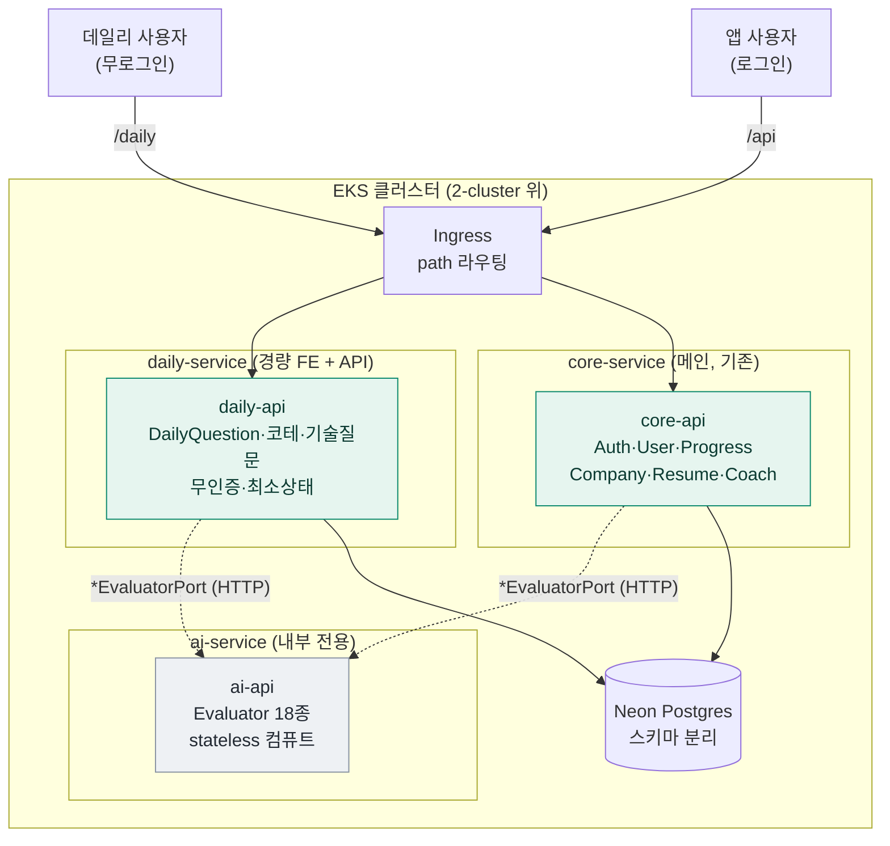

# 서비스 분해 설계 — daily + ai-service + core

> 2026-07-20 brainstorming 산출물. 모듈러 모놀리스(단일 Spring 앱)를 3개 배포 서비스로 분해.
> 상위 맥락: `.claude/CONTEXT.md` / 아키텍처 다이어그램 규칙: `docs/architecture/`.
> ⚠️ 이 문서는 **설계**다. 구현 계획(phase별 태스크)은 승인 후 별도 plan 문서로.

## 배경 / 목적

**트리거(가장 강한 신호): "만든 사람조차 안 쓴다."** 현재 앱은 RPG 여정·회사 파이프라인·이력서까지
기능 12개를 한 허브에 얹은 무거운 제품이라, 매일 쓰는 습관 도구가 되지 못한다.

**방향 전환**: 취업·이직에 도움되지만 **가볍게 매일 쓰는 도구**(데일리 기술질문·코테)를 타겟으로.
이를 위해 **메인 뼈대와 부가(라이트) 기능을 별도 서버로 분리** — 동시에 EKS 학습(다중 서비스 배포) 재료로 활용.

**결정된 분리(3서비스)**: `core` (메인) / `ai-service` (AI 컴퓨트) / `daily-service` (라이트 데일리 제품).

## 현재 구조 (출발점)

```
단일 Spring 앱 · 헥사고날 · Gradle 모듈은 "계층"으로 분리(기능 아님):
  core-enum · core-domain(순수 도메인 + 포트) · core-api(컨트롤러/서비스)
  storage:db-core(DB 어댑터) · clients:client-ai(AI 어댑터) · support:logging/monitoring
기능 = 컨트롤러 11개(Auth·User·Progress·AiCheck·DailyQuestion·TechInterview·
  InterviewCoach·CodingQuest·Company·Resume·Health)
```

### 🔑 결정적 발견 (설계의 근거)
- **AI 경계가 이미 포트로 존재**: `core-domain`에 `*EvaluatorPort`(Blog·Interview·Jd·Resume·Boss·
  DeveloperClass·SystemDesign·Personality·CompanyFit·Essay 등) 인터페이스. `client-ai`의 평가자 18개가
  이를 **구현(어댑터)**. → ai-service 추출은 **포트는 그대로 두고 어댑터만 in-process→HTTP로 교체**.
- **AI는 다수 feature가 공유**: AiCheck·Company·DailyQuestion·TechInterview 서비스가 포트를 주입.
  → ai-service는 특정 컨트롤러가 아니라 **공유 컴퓨트 레이어**로 뽑아야 맞다.
- **daily도 AI를 쓴다**: DailyQuestionService가 AI 포트 소비 → daily-service는 ai-service를 호출한다.

## 확정된 설계 결정

| 결정 | 선택 | 근거 | 확도 |
|------|------|------|:----:|
| repo/모듈 토폴로지 | **모노레포 멀티모듈** — 앱 3개가 공유 core 모듈을 의존, 각자 이미지 빌드 | 별도 repo·라이브러리 퍼블리시 오버헤드 없이 코드 공유. 기존 Gradle 구조에 자연스러움 | 🔴 |
| ai-service 성격 | **내부 전용 stateless 컴퓨트** (ClusterIP, 유저 직접 노출 X) | 계산만 수행, 평가 결과 데이터는 호출자(core)가 소유. 과거 OOM/토큰/지연 이슈를 독립 격리 | 🟡 |
| ai-service 계약 | **기존 `*EvaluatorPort`를 HTTP로 재현** — core/daily는 포트 어댑터를 HTTP 클라이언트로 교체 | 포트가 이미 있어 계약이 정의돼 있음. 최소 침습 | 🔴 |
| daily-service 성격 | 무로그인 · 경량 · 최소 상태(문제 시드 + rate-limit) · 독립 경량 FE | 매일 쓰는 라이트 제품. scale-to-zero로 저비용 | 🟡 |
| 인증 경계 | daily=무인증 / **ai=NetworkPolicy만**(ClusterIP 내부 전용, 앱레벨 인증 없음) / core=기존 유저 인증 | ai는 내부 전용이라 유저 인증 불필요. 학습 시작엔 NetworkPolicy가 가장 싸고 EKS 네트워킹 실습 표본. 필요 시 토큰/mTLS로 승격 | 🔴 확정(07-20) |
| 이관 순서 | **strangler: ① ai-service ② daily-service ③ core는 그대로** (빅뱅 금지) | ai는 포트 덕에 가장 깨끗·학습가치 큼. daily는 무인증이라 얽힘 적음. core는 최대한 유지 | 🔴 |
| DB 전략 (초기) | **공유 Neon Postgres 유지** — ai=DB 없음(stateless), daily=자체 스키마/테이블, core=기존 소유 | DB-per-service는 순수하나 솔로 프로젝트엔 과함. 스키마 분리로 시작, 필요 시 물리 분리 | 🔴 확정(07-20) |
| daily FE 시점 | **Phase 2에 경량 FE 함께 출시** | 제품(라이트 데일리) 검증을 가장 빨리. API만 먼저 내면 쓸 제품이 늦음 | 🔴 확정(07-20) |

### 기각한 대안
- **풀 마이크로서비스**(회사·이력서·코딩·면접 전부 분리): 분산 데이터 정합성·서비스간 인증·배포 N개.
  솔로 프로젝트엔 비용이 값을 압도(마이크로서비스 트랩). 3개까지만.
- **DB-per-service (즉시)**: 데이터 소유는 깔끔하나 마이그레이션·정합성 부담 큼. 스키마 분리로 시작 후 옵션으로 유보.
- **별도 repo(polyrepo)**: 공유 core를 라이브러리로 퍼블리시해야 함(버전·CI 복잡). 모노레포 멀티모듈로 회피.
- **라이트 FE만 분리(백엔드 모놀리스 유지)**: 제품 검증엔 제일 싸나, 사용자가 3서비스 분리를 택함. 설계 중 비용이 커 보이면 재고 카드로 유지.

## 목표 아키텍처



- **공유 모듈**(core-enum·core-domain·db-core·client-ai)은 그대로 두고, **앱 모듈 3개**(`core-api`·`ai-api`·`daily-api`)가 필요한 것만 의존.
- `client-ai`(평가자 구현)는 **ai-api에만** 묶임. core/daily는 core-domain의 포트를 **HTTP 어댑터**로 구현.

## 서비스 경계 상세

| 서비스 | 담는 것 | 데이터 | 인증 | 노출 |
|--------|--------|--------|------|------|
| **core** | Auth·UserEmail·Progress·AiCheck(오케스트레이션)·Company·Resume·InterviewCoach·CodingQuest | 기존 DB 소유 | 유저 인증(기존) | `/api` public |
| **ai-service** | Evaluator 18종 + `client-ai` + Judge0 어댑터 | 없음(stateless) | 서비스간 내부 인증 | ClusterIP 내부만 |
| **daily-service** | DailyQuestion·데일리 기술질문·코테 슬라이스 + 경량 FE | 자체 스키마(문제 시드·rate-limit) | 무인증 | `/daily` public |

## 이관 계획 (strangler, phase 개요 — 상세 태스크는 별도 plan)

- **Phase 0 — 준비 (무행동 변경)**: `ai-api` Gradle 앱 모듈 스캐폴드. core-domain 포트 뒤에 **HTTP 어댑터**를
  피처플래그(in-process ↔ HTTP)로 도입. 기존 동작 그대로.
- **Phase 1 — ai-service 추출**: `client-ai`·평가자를 ai-api로 이동, ai-api를 독립 앱으로 기동.
  core의 포트 어댑터를 HTTP로 전환. **동작 확인**: 기존 AI 평가 결과 parity(같은 입력→같은 스키마 응답).
- **Phase 2 — daily-service 추출 (+경량 FE 확정)**: DailyQuestion 로직을 daily-api로 이동(ai-service 호출),
  무인증 경량 FE를 **함께** 출시(제품 먼저 검증). **동작 확인**: 무로그인으로 오늘의 질문→AI 설명까지 e2e.
- **Phase 3 — EKS 배포 토폴로지**: Deployment ×3 + Ingress path 라우팅(/api, /daily, ai는 내부),
  ai-service 서비스간 인증·NetworkPolicy. 2-cluster 위에 얹음. **동작 확인**: 클러스터에서 3서비스 e2e.

각 phase는 독립 배포 가능·롤백 가능해야 함. core는 Phase 1~2 동안 계속 동작.

## 리스크 / 트레이드오프

- **리스크**: 3분리는 되돌리기 비싼 구조 변경. 서비스 경계 오설정 시 서비스간 호출 폭발. → 포트가 이미 있는 AI만
  먼저(검증된 seam), 나머지는 신중히.
- **전제**: 헥사고날 포트가 깨끗해 세로 분리가 저비용. 이 전제가 깨지는 지점(포트 없는 기능)은 분리 대상에서 제외.
- **분산의 새 비용**: 서비스간 지연(특히 AI 호출 체인 daily→ai), 부분 실패, 관측(분산 트레이싱 필요), 배포·CI ×3.
- **대안 회귀 카드**: Phase 0~1에서 비용이 값을 넘어서면 "라이트 FE만 분리"로 후퇴 가능.

## 완료 조건 (에픽 전체)
1. ai-service·daily-service·core가 각각 독립 배포되고 로컬/EKS에서 e2e 동작
2. AI 평가 결과가 분리 전후 parity
3. 무로그인으로 데일리 도구 e2e (daily→ai)
4. EKS에 3 Deployment + Ingress 라우팅, ai 내부 전용
5. 아키텍처 다이어그램(`docs/architecture/`) 갱신, 각 phase 검증 기록

## 확정된 결정 (07-20 리뷰)
- **daily FE 시점**: Phase 2에 경량 FE **함께** 출시 (제품 먼저 검증).
- **ai 내부 인증**: **NetworkPolicy만** — ai=ClusterIP 내부 전용, 앱레벨 인증 없음. 필요 시 토큰/mTLS로 승격.
- **DB 전략**: **공유 Neon + 스키마 분리** (ai=DB 없음). 물리 분리는 트리거 생기면.

## 열린 질문 (구현 중 실증/결정)
- **core의 AiCheck**: 오케스트레이션만 core에 남기고 평가는 ai로 위임하는 경계가 맞는지 Phase 1에서 실증.
- **DB 물리 분리 트리거**: 공유 스키마로 시작 → 성능·소유 경계 문제 생기면 분리 판단.
- **관측**: 서비스간 분산 트레이싱(현재 Grafana OTLP 단일 앱 전제) 확장 — Phase 3에서.
