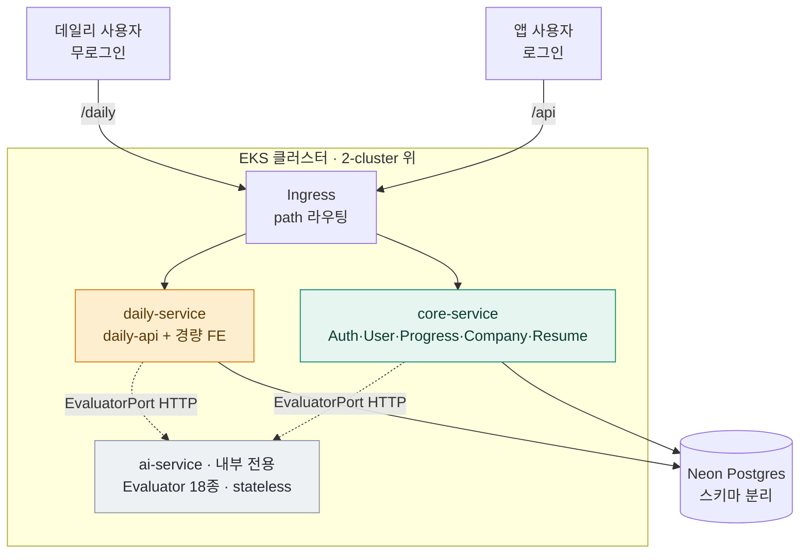

# 서비스 분해 설계 — daily + ai-service + core

> 2026-07-20 brainstorming 산출물. 모듈러 모놀리스(단일 Spring 앱)를 3개 배포 서비스로 분해.
> 상위 맥락: `.claude/CONTEXT.md` / 아키텍처 다이어그램 규칙: `docs/architecture/`.
> ⚠️ 이 문서는 **설계**다. 구현 계획(phase별 태스크)은 승인 후 별도 plan 문서로.

## 배경 / 목적

**트리거(가장 강한 신호): "만든 사람조차 안 쓴다."** 현재 앱은 RPG 여정·회사 파이프라인·이력서까지
기능 12개를 한 허브에 얹은 무거운 제품이라, 매일 쓰는 습관 도구가 되지 못한다.

**방향 전환**: 취업·이직에 도움되지만 **가볍게 매일 쓰는 도구**(데일리 기술질문·코테)를 타겟으로.
이를 위해 **메인 뼈대와 부가(라이트) 기능을 별도 서버로 분리** — 동시에 EKS 학습(다중 서비스 배포) 재료로 활용.

**결정된 분리(3서비스)**: `core` (메인) / `ai-service` (AI 컴퓨트) / `daily-service` (라이트 데일리 제품).

## 현재 구조 (출발점)

```
단일 Spring 앱 · 헥사고날 · Gradle 모듈은 "계층"으로 분리(기능 아님):
  core-enum · core-domain(순수 도메인 + 포트) · core-api(컨트롤러/서비스)
  storage:db-core(DB 어댑터) · clients:client-ai(AI 어댑터) · support:logging/monitoring
기능 = 컨트롤러 11개(Auth·User·Progress·AiCheck·DailyQuestion·TechInterview·
  InterviewCoach·CodingQuest·Company·Resume·Health)
```

### 🔑 결정적 발견 (설계의 근거)
- **AI 경계가 이미 포트로 존재**: `core-domain`에 `*EvaluatorPort`(Blog·Interview·Jd·Resume·Boss·
  DeveloperClass·SystemDesign·Personality·CompanyFit·Essay 등) 인터페이스. `client-ai`의 평가자 18개가
  이를 **구현(어댑터)**. → ai-service 추출은 **포트는 그대로 두고 어댑터만 in-process→HTTP로 교체**.
- **AI는 다수 feature가 공유**: AiCheck·Company·DailyQuestion·TechInterview 서비스가 포트를 주입.
  → ai-service는 특정 컨트롤러가 아니라 **공유 컴퓨트 레이어**로 뽑아야 맞다.
- **daily도 AI를 쓴다**: DailyQuestionService가 AI 포트 소비 → daily-service는 ai-service를 호출한다.

## 확정된 설계 결정

| 결정 | 선택 | 근거 | 확도 |
|------|------|------|:----:|
| repo/모듈 토폴로지 | **모노레포 멀티모듈** — 앱 3개가 공유 core 모듈을 의존, 각자 이미지 빌드 | 별도 repo·라이브러리 퍼블리시 오버헤드 없이 코드 공유. 기존 Gradle 구조에 자연스러움 | 🔴 |
| ai-service 성격 | **내부 전용 stateless 컴퓨트** (ClusterIP, 유저 직접 노출 X) | 계산만 수행, 평가 결과 데이터는 호출자(core)가 소유. 과거 OOM/토큰/지연 이슈를 독립 격리 | 🟡 |
| ai-service 계약 | **기존 `*EvaluatorPort`를 HTTP로 재현** — core/daily는 포트 어댑터를 HTTP 클라이언트로 교체 | 포트가 이미 있어 계약이 정의돼 있음. 최소 침습 | 🔴 |
| daily-service 성격 | 무로그인 · 경량 · 최소 상태(문제 시드 + rate-limit) · 독립 경량 FE | 매일 쓰는 라이트 제품. scale-to-zero로 저비용 | 🟡 |
| 인증 경계 | daily=무인증 / **ai=NetworkPolicy만**(ClusterIP 내부 전용, 앱레벨 인증 없음) / core=기존 유저 인증 | ai는 내부 전용이라 유저 인증 불필요. 학습 시작엔 NetworkPolicy가 가장 싸고 EKS 네트워킹 실습 표본. 필요 시 토큰/mTLS로 승격 | 🔴 확정(07-20) |
| 이관 순서 | **strangler: ① ai-service ② daily-service ③ core는 그대로** (빅뱅 금지) | ai는 포트 덕에 가장 깨끗·학습가치 큼. daily는 무인증이라 얽힘 적음. core는 최대한 유지 | 🔴 |
| DB 전략 (초기) | **공유 Neon Postgres 유지** — ai=DB 없음(stateless), daily=자체 스키마/테이블, core=기존 소유 | DB-per-service는 순수하나 솔로 프로젝트엔 과함. 스키마 분리로 시작, 필요 시 물리 분리 | 🔴 확정(07-20) |
| daily FE 시점 | **Phase 2에 경량 FE 함께 출시** | 제품(라이트 데일리) 검증을 가장 빨리. API만 먼저 내면 쓸 제품이 늦음 | 🔴 확정(07-20) |

### 기각한 대안
- **풀 마이크로서비스**(회사·이력서·코딩·면접 전부 분리): 분산 데이터 정합성·서비스간 인증·배포 N개.
  솔로 프로젝트엔 비용이 값을 압도(마이크로서비스 트랩). 3개까지만.
- **DB-per-service (즉시)**: 데이터 소유는 깔끔하나 마이그레이션·정합성 부담 큼. 스키마 분리로 시작 후 옵션으로 유보.
- **별도 repo(polyrepo)**: 공유 core를 라이브러리로 퍼블리시해야 함(버전·CI 복잡). 모노레포 멀티모듈로 회피.
- **라이트 FE만 분리(백엔드 모놀리스 유지)**: 제품 검증엔 제일 싸나, 사용자가 3서비스 분리를 택함. 설계 중 비용이 커 보이면 재고 카드로 유지.

## 목표 아키텍처



- **공유 모듈**(core-enum·core-domain·db-core·client-ai)은 그대로 두고, **앱 모듈 3개**(`core-api`·`ai-api`·`daily-api`)가 필요한 것만 의존.
- `client-ai`(평가자 구현)는 **ai-api에만** 묶임. core/daily는 core-domain의 포트를 **HTTP 어댑터**로 구현.

## 서비스 경계 상세

| 서비스 | 담는 것 | 데이터 | 인증 | 노출 |
|--------|--------|--------|------|------|
| **core** | Auth·UserEmail·Progress·AiCheck(오케스트레이션)·Company·Resume·InterviewCoach·CodingQuest | 기존 DB 소유 | 유저 인증(기존) | `/api` public |
| **ai-service** | Evaluator 18종 + `client-ai` + Judge0 어댑터 | 없음(stateless) | 서비스간 내부 인증 | ClusterIP 내부만 |
| **daily-service** | DailyQuestion·데일리 기술질문·코테 슬라이스 + 경량 FE | 자체 스키마(문제 시드·rate-limit) | 무인증 | `/daily` public |

## 이관 계획 (strangler, phase 개요 — 상세 태스크는 별도 plan)

- **Phase 0 — 준비 (무행동 변경)**: `ai-api` Gradle 앱 모듈 스캐폴드. core-domain 포트 뒤에 **HTTP 어댑터**를
  피처플래그(in-process ↔ HTTP)로 도입. 기존 동작 그대로.
- **Phase 1 — ai-service 추출**: `client-ai`·평가자를 ai-api로 이동, ai-api를 독립 앱으로 기동.
  core의 포트 어댑터를 HTTP로 전환. **동작 확인**: 기존 AI 평가 결과 parity(같은 입력→같은 스키마 응답).
- **Phase 2 — daily-service 추출 (+경량 FE 확정)**: DailyQuestion 로직을 daily-api로 이동(ai-service 호출),
  무인증 경량 FE를 **함께** 출시(제품 먼저 검증). **동작 확인**: 무로그인으로 오늘의 질문→AI 설명까지 e2e.
- **Phase 3 — EKS 배포 토폴로지**: Deployment ×3 + Ingress path 라우팅(/api, /daily, ai는 내부),
  ai-service 서비스간 인증·NetworkPolicy. 2-cluster 위에 얹음. **동작 확인**: 클러스터에서 3서비스 e2e.

각 phase는 독립 배포 가능·롤백 가능해야 함. core는 Phase 1~2 동안 계속 동작.

## 리스크 / 트레이드오프

- **리스크**: 3분리는 되돌리기 비싼 구조 변경. 서비스 경계 오설정 시 서비스간 호출 폭발. → 포트가 이미 있는 AI만
  먼저(검증된 seam), 나머지는 신중히.
- **전제**: 헥사고날 포트가 깨끗해 세로 분리가 저비용. 이 전제가 깨지는 지점(포트 없는 기능)은 분리 대상에서 제외.
- **분산의 새 비용**: 서비스간 지연(특히 AI 호출 체인 daily→ai), 부분 실패, 관측(분산 트레이싱 필요), 배포·CI ×3.
- **대안 회귀 카드**: Phase 0~1에서 비용이 값을 넘어서면 "라이트 FE만 분리"로 후퇴 가능.

## 스케일링 & 비용 (데일리 급증 대비)

데일리 사용자가 늘면 압력이 오는 곳은 이 순서다(**낮은 천장부터**):

| 벽 | 언제 터지나 | 대응 |
|----|-----------|------|
| **📧 이메일/SMTP (가장 낮음)** | 무료 티어 ~100통/일 → **데일리 유저 ~100명** | Resend 유료($20/5만통) or **AWS SES 전환**($0.10/1k, 사실상 무제한 저가) · **큐·드립 발송**으로 9시 버스트 해소 · **opt-in/다이제스트**로 발송량↓ |
| **💸 LLM 토큰 비용** | 개인화 AI 설명 급증 | 공통 콘텐츠 **캐시**(1회 생성→N명 서빙) · 데일리는 **싼 모델** · 유저별 rate-limit · 예산 가드 |
| **⚙️ ai-service** | 캐시 못 하는 호출 급증 | HPA + LLM 동시성/쿼터 관리 · 백프레셔·큐잉 |
| **daily 파드 / DB** | 그 이후 | daily-api HPA(무상태) · rate-limit 카운터를 **Redis**로(DB 핫 write 회피) · 오늘의 문제 캐시 |
| Ingress/LB | 대개 마지막 | 플랫폼이 흡수 |

### 핵심 레버 — 캐싱이 병목 위치를 바꾼다 🔴
- **공통 콘텐츠**(오늘의 문제·공통 설명)는 "1회 생성 → 전원 캐시 서빙" → **LLM 호출을 사용자 수에서 분리**. ai-service 부하 붕괴.
- **개인화**(휘발형 후속질문, 유저별 5회/일)만 고유 LLM 호출로 남김 → 여기만 ai-service·토큰 비용 대상.
- 현재 데일리 구성(실측): ① 질문뱅크 문제(`ORDER BY RANDOM()` = 값싼 DB 읽기) ② 휘발형 AI 설명(rate-limit, LLM 호출). **②만 진짜 스케일·비용 지점.**

### 이메일 실측 (근거)
- provider = **Resend**(`smtp.resend.com`), `DailyMailScheduler` = `@Scheduled(cron "0 0 9 * * *", KST)`,
  `userEmailPort.findAll()` → 전체 유저 → `forEach { send }` = **1유저 1메일/일, 9시 버스트**.
- 무료 티어 ≈ 100통/일·3,000통/월(정확 수치 재확인) + API rate-limit ~2req/s → **버스트도 문제**.

### 배치 결정 (설계 반영 필요)
- 데일리 메일은 **데일리 제품의 습관 루프** → `daily-service` 소유가 자연스러움. 그러나 **수신자 이메일은 core 소유**.
  → **선택**: (a) 스케줄러·발송은 core에 두고 daily가 콘텐츠만 제공 / (b) daily가 core의 "구독자 조회" API를 호출.
  Phase 2에서 확정. 어느 쪽이든 발송 인프라(SES 전환·큐)는 별도 관심사로 뺀다.

## EKS 인프라 영향 (기존 레이어 설계와의 관계)

**핵심: 토대는 워크로드에 무관해 대부분 재사용된다.** 앱이 1개든 3개든 클러스터 인프라는 같다.
아래는 3분리가 실제로 건드리는 지점만.

| 레이어 | 3분리로 바뀌나 | 내용 |
|--------|:--:|------|
| 0-bootstrap · 1-network | ❌ | backend·OIDC·예산·VPC·서브넷·IGW 그대로 |
| 2-cluster 골격(CP·노드그룹) | ⚠️ | **addon·노드 용량은 수정 필요**(아래) |
| Ingress/ALB | ⬆️ | "나중 Stage"에서 **핵심**으로 승격 |
| ECR·IRSA·관측·gitops | 📈 | 1개 → 3개 규모 |

### ⚠️ 이미 머지한 2-cluster를 손대야 하는 것 (놓치기 쉬움)
1. **vpc-cni addon에 NetworkPolicy 활성화** 🟡 — ai-service를 "NetworkPolicy만"으로 격리하는 인증 결정은
   **AWS VPC CNI가 NetworkPolicy를 강제해야** 성립. 현재 `addons.tf`의 vpc-cni는 설정 없이 맨몸 →
   `configuration_values`로 `enableNetworkPolicy: "true"`를 켜거나 Calico 도입 필요. **이 결정의 전제 인프라.**
2. **노드 용량** 🟡 — Spring 앱 ~300~450MB × 3 ≈ 1~1.4GB + 시스템 파드 → **t4g.small(2GB) 빠듯**.
   t4g.medium(4GB)로 승격 or 노드 2개. "1노드 미니멀" 가정 깨짐, 비용 소폭↑.

### 3분리로 새로/더 커지는 것
- **Ingress/ALB** 🔴: path 라우팅(/api·/daily, ai 내부)이 토폴로지의 중심 → Ingress 컨트롤러가 조기 필요.
- **ECR**: 이미지 1 → 3 (리포 3개 or 태그 분리).
- **IRSA**: 서비스가 AWS 직접 호출 시(ai→Bedrock?, daily 메일→SES?) 서비스별 역할. OIDC 프로바이더는 2-cluster에 이미 존재.
- **관측**: 단일 앱 OTLP → 멀티서비스 분산 트레이싱(서비스간 trace 상관관계).
- **gitops(ArgoCD)**: 앱 1 → 3 매니페스트.

→ Phase 3(EKS 배포)에서 이 목록을 체크리스트로 사용. 특히 **#1(NetworkPolicy)은 인증 결정의 전제**라 우선.

## 완료 조건 (에픽 전체)
1. ai-service·daily-service·core가 각각 독립 배포되고 로컬/EKS에서 e2e 동작
2. AI 평가 결과가 분리 전후 parity
3. 무로그인으로 데일리 도구 e2e (daily→ai)
4. EKS에 3 Deployment + Ingress 라우팅, ai 내부 전용
5. 아키텍처 다이어그램(`docs/architecture/`) 갱신, 각 phase 검증 기록

## 확정된 결정 (07-20 리뷰)
- **daily FE 시점**: Phase 2에 경량 FE **함께** 출시 (제품 먼저 검증).
- **ai 내부 인증**: **NetworkPolicy만** — ai=ClusterIP 내부 전용, 앱레벨 인증 없음. 필요 시 토큰/mTLS로 승격.
- **DB 전략**: **공유 Neon + 스키마 분리** (ai=DB 없음). 물리 분리는 트리거 생기면.
- **배포 전략 (확정, 재론 안 함)**: **EKS = 실습**($200 크레딧 한도 내 destroy-after-use로 3서비스 학습) /
  **Fly.io = 상시 fallback**(언제든 복귀 가능한 안전지대). Cloud Run·Oracle·Render 등 대안은 **이미 고려·기각**.
  배포 타겟은 열린 문제 아님. EKS 비용통제는 scale-to-zero가 아니라 **destroy-after-use 규율**로.

## 열린 질문 (구현 중 실증/결정)
- **core의 AiCheck**: 오케스트레이션만 core에 남기고 평가는 ai로 위임하는 경계가 맞는지 Phase 1에서 실증.
- **DB 물리 분리 트리거**: 공유 스키마로 시작 → 성능·소유 경계 문제 생기면 분리 판단.
- **관측**: 서비스간 분산 트레이싱(현재 Grafana OTLP 단일 앱 전제) 확장 — Phase 3에서.
- **데일리 캐싱 전략**: 공통 콘텐츠 캐시 계층(문제·공통 설명 1회 생성→서빙) 도입 시점·저장소(Redis 등) — Phase 2.
- **이메일 발송 인프라**: 무료 티어 ~100/일 천장 도달 전 SES 전환 + 큐·드립 발송. 데일리 메일 소유(core vs daily) — Phase 2 확정.
